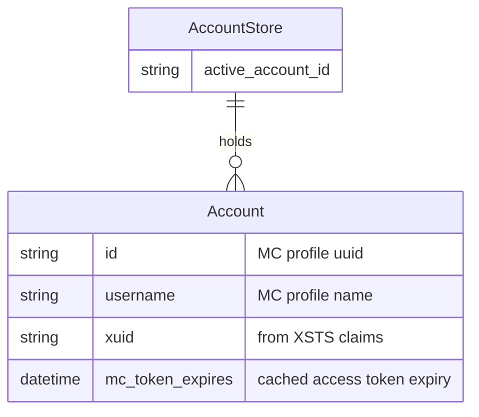

# Authentication (Phase 3)

## Problem

Launch currently injects a hardcoded offline identity (`Player` + UUIDv3 of
`"OfflinePlayer:Player"`, access token `"0"`) — see `core/launch.rs:30-44,150-153`.
Online servers reject this. Users need to sign in with a real Microsoft account so the
launcher obtains a genuine Minecraft access token, profile UUID, and username, then launches
authenticated. Multiple accounts must be supported, with refresh tokens kept out of
plaintext.

## Goals / Non-goals

**Goals**
- Microsoft OAuth 2.0 **device-code** flow (no embedded browser): user opens a URL, enters a
  code, the backend polls to completion.
- Full token chain → Minecraft identity: `MS token → Xbox Live (XBL) → XSTS → Minecraft
  services token → profile`.
- Multi-account: add, list, remove, pick active.
- Refresh-token persistence in the **OS keychain** (`keyring` crate); non-secret account
  metadata in a JSON file under the app data dir.
- Token refresh: a stored refresh token silently re-derives a fresh MC access token at launch
  time when the cached one is expired.
- Launch threads the active account's real identity into argv. Offline identity retained
  behind a setting.

**Non-goals**
- Embedded webview / authorization-code-with-PKCE browser flow. Device code only.
- Skin/cape rendering, account avatars beyond what the profile returns.
- Online-mode *enforcement* per instance (instance-level account binding) — Phase 3 uses one
  global active account.
- Mojang (pre-Microsoft) legacy account migration.
- Pre-1.7 `assets_legacy` work (already deferred — `vanilla-launch-f-1/-f-2`).

## Decisions (resolved with user)

| Decision | Choice | Rationale |
|----------|--------|-----------|
| Azure client_id | **Official public Minecraft launcher client_id** shipped as a constant | Works out-of-box, no per-user Azure registration; common in open-source launchers. |
| Offline mode | **Kept** behind a setting | Preserves the no-account dev/test + cracked-server path. |
| Token storage | `keyring` crate for the refresh-token secret; `accounts.json` for non-secret metadata | ARCHITECTURE.md §7 already commits to `keyring`; metadata needs listing without unlocking the keychain. |
| HTTP client | Hand-rolled chain over existing `reqwest` | Consistent with `download.rs` / `java.rs` / `meta.rs` — no all-in-one MC-auth crate is maintained. |
| Device-code UX | Event-driven single command (mirrors `download://progress`, `launch://log`) | `begin_login` emits an `auth://device-code` event with the user code + URL, polls internally, resolves on success/failure. |

## Auth chain

Sequence of the device-code → Minecraft-identity pipeline. Each arrow is one HTTPS request.

```mermaid
sequenceDiagram
    participant UI as Accounts UI
    participant BE as core/auth.rs
    participant MS as login.microsoftonline.com
    participant XBL as user.auth.xboxlive.com
    participant XSTS as xsts.auth.xboxlive.com
    participant MC as api.minecraftservices.com

    UI->>BE: begin_login()
    BE->>MS: POST devicecode (client_id, scope=XboxLive.signin offline_access)
    MS-->>BE: device_code, user_code, verification_uri, interval, expires_in
    BE-->>UI: emit auth://device-code {user_code, verification_uri}
    loop poll every `interval`s until expiry
        BE->>MS: POST token (grant=device_code)
        MS-->>BE: authorization_pending | access_token + refresh_token
    end
    BE->>XBL: POST authenticate (RpsTicket = MS access_token)
    XBL-->>BE: xbl_token, uhs (userhash)
    BE->>XSTS: POST authorize (xbl_token)
    XSTS-->>BE: xsts_token, xuid (DisplayClaims.xui[0].xid)
    BE->>MC: POST login_with_xbox (uhs + xsts_token)
    MC-->>BE: mc_access_token, expires_in
    BE->>MC: GET minecraft/profile (Bearer mc_access_token)
    MC-->>BE: id (uuid), name
    BE->>BE: store refresh_token in keyring; metadata in accounts.json
    BE-->>UI: resolve begin_login → Account
```

**Refresh path:** at launch (or on demand) if the cached MC token is expired, replay from the
`MS token` step using the stored `refresh_token` (`grant_type=refresh_token`) → XBL → XSTS →
MC token. No device-code prompt needed.

## Data model



- `accounts.json` (under data dir, sibling to instances/java dirs per `store.rs:14-35`) holds
  the `AccountStore`: account list (non-secret metadata) + `active_account_id`.
- The **refresh token** never lands in `accounts.json` — it lives in the keychain keyed by
  account id.
- The **MC access token** is short-lived; held in memory and re-derived via refresh when
  expired. Not persisted (or persisted only as opaque cache — implementer's call, but it must
  never be the source of truth over the refresh token).

## Error taxonomy

| Stage | Failure | Surface to user |
|-------|---------|-----------------|
| Device poll | `authorization_pending` | keep polling (not an error) |
| Device poll | `expired_token` / timeout | "Code expired, try again" |
| Device poll | `authorization_declined` / `access_denied` | "Sign-in cancelled" |
| XSTS | `2148916233` | "No Xbox account — create one first" |
| XSTS | `2148916235` | "Xbox Live unavailable in your region" |
| XSTS | `2148916238` | "Child account — needs adult consent (add to Family)" |
| Profile | HTTP 404 | "This account doesn't own Minecraft" |
| keyring | backend unavailable (Linux/WSL no secret-service) | surface clearly; login fails loud, not silent |

## Approaches

### A. Token-storage strategy

| # | Approach | Pros | Cons |
|---|----------|------|------|
| A1 | `keyring` for refresh token + `accounts.json` for metadata *(chosen)* | Matches ARCHITECTURE §7; metadata listable without keychain unlock; secret never on disk | `keyring` Linux/WSL needs secret-service daemon; tests must inject a fake backend |
| A2 | Everything in an encrypted file (age/ring) | No OS keychain dependency; works headless | We own key management; reinvents what the OS provides; ARCHITECTURE says keyring |
| A3 | Plaintext JSON incl. refresh token | Trivial | Refresh token = long-lived credential in plaintext. Rejected. |

### B. Device-code UX threading

| # | Approach | Pros | Cons |
|---|----------|------|------|
| B1 | Event-driven single command *(chosen)* | Mirrors `download://progress` + `launch://log`; one round-trip; backend owns the poll loop | Command is long-lived; need a cancel path |
| B2 | Two-phase (`start_login` returns code, `poll_login` called by UI) | Stateless commands | UI drives polling — more IPC chatter; duplicates interval logic in TS |

### C. Auth client

| # | Approach | Pros | Cons |
|---|----------|------|------|
| C1 | Hand-rolled chain over `reqwest` *(chosen)* | Consistent with every other `core/` net module; full control over error mapping; testable via the existing `TcpListener`/fixture conventions | More code than a crate would be |
| C2 | A third-party MS-MC auth crate | Less code | None maintained to the standard we'd trust; opaque error mapping; new dep surface |

## Recommendation

**A1 + B1 + C1.** Hand-rolled `reqwest` chain in a new `core/auth.rs`, refresh token in
`keyring`, metadata in `accounts.json`, device-code surfaced via an `auth://device-code`
event from a single `begin_login` command. This is the lowest-surprise path: every choice
matches an existing convention in the repo (net-in-Rust, event streaming, fixture/mock tests,
the ARCHITECTURE §7 keyring commitment).

**Testing convention (hard constraint):** no live HTTP in tests — follow `download.rs`
(`TcpListener` mock) and `java.rs` (fixtures + injected provision closure). The keyring access
and the HTTP chain must be behind injectable seams so unit tests run offline and without a
secret-service daemon.

## Open questions

- **keyring on dev/WSL:** the dev environment is WSL, which often lacks a secret-service
  daemon. Does login need to *work* in dev, or is failing-loud acceptable there (real use is on
  desktop Win/macOS/Linux with a keychain)? Leaning: fail loud in dev, document the limitation;
  do not add a plaintext fallback (defeats the purpose).
- **MC token caching:** persist the short-lived MC access token across launches (faster
  re-launch, skips a refresh round-trip) or always refresh? Leaning: don't persist — always
  refresh if expired; simpler, the refresh round-trip is fast.
- **xuid source:** XSTS `DisplayClaims.xui[0].xid` vs. decoding the MC token JWT. Leaning:
  XSTS claims (already parsed, no JWT decode dependency).
