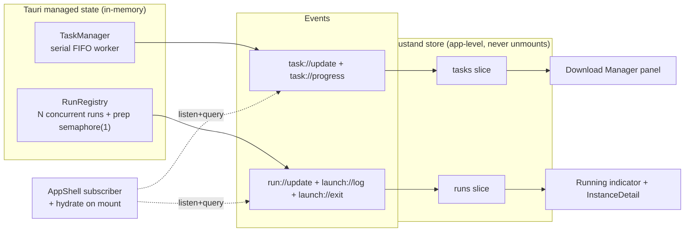
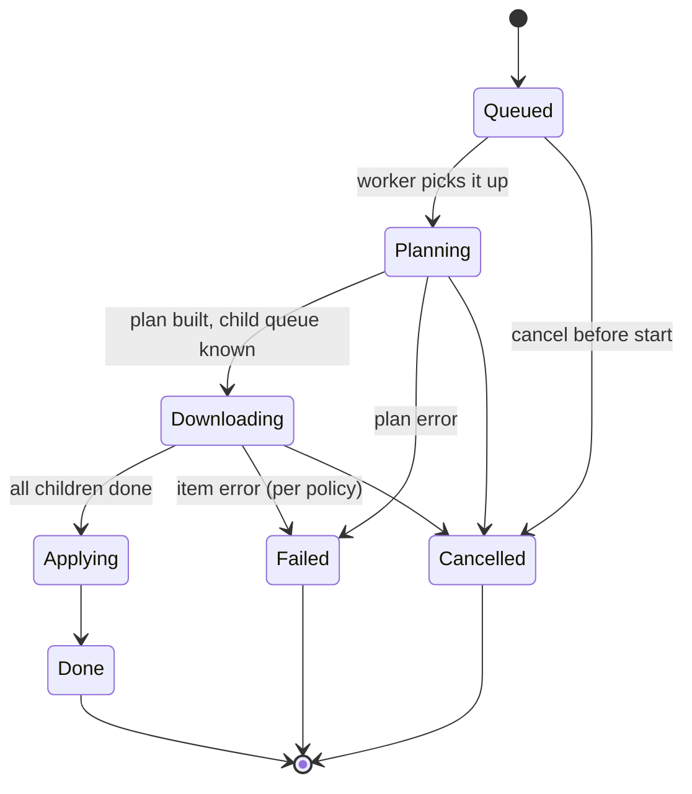
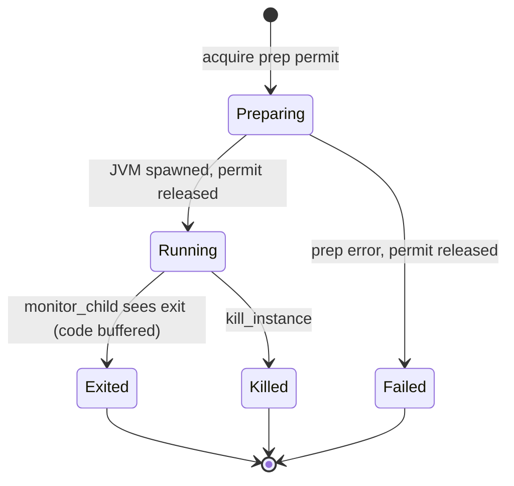
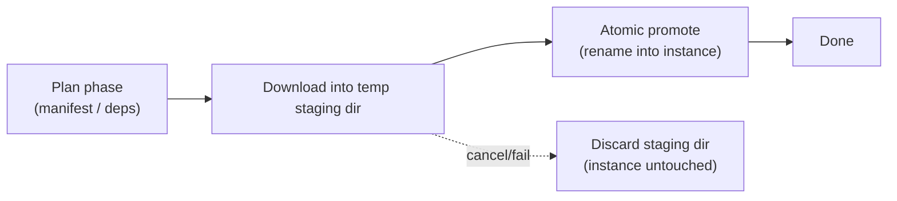

# Download Manager & Runner rework

## Problem

Long-running actions are bound to page lifecycle, not the app. Navigating away "kills" them from the user's point of view.

Root cause is **tracking teardown**, not work cancellation:

- **Launches** already survive in the backend (`RunningRegistry` in managed state + detached `monitor_child` task). But the UI forgets them: `InstanceDetail` tracks `running`/`logLines` in component `useState` and subscribes to `launch://log` / `launch://exit` in a `useEffect` torn down on unmount (`InstanceDetail.tsx:88-138`). Events are unbuffered global broadcasts, so a re-entering page misses interim lines and the exit event. No command enumerates running instances.
- **Downloads / installs / updates / mod ops** have *no* backend persistence. Each is a one-shot `#[tauri::command]` fully awaited inline with `NoOpSink` (no progress), no id, no registry, no cancel/resume. The Rust future runs to completion headless, but its result is bound solely to the `invoke` promise the navigating page drops.
- **No app-level frontend state** for operations. Zustand is installed but unused; no context. Only the TanStack Query *data* cache survives navigation.

The user wants two **decoupled** lanes with full continuity:

- a **Download Manager** that runs installs / updates / removals as a serial, hierarchical, cancellable task queue;
- a **Runner** that tracks N concurrent running packs, serializing the blocking prep but never blocking on a pack's exit.

## Goals / Non-goals

**Goals**
- Every mutating op survives navigation and is observable + cancellable from any page.
- Download Manager: **serial** FIFO queue; **hierarchical** tasks — a parent op (e.g. "Update ATM10") runs a *plan phase* (fetch manifest / resolve deps) then an *execute phase* iterating child items, surfacing parent label + current child + counts.
- Runner: track **N concurrent running packs**; **serialize** blocking launch prep (resolve → download → materialize → natives), return immediately once the JVM spawns (never wait on exit), **warn** before launching a 2nd+ pack.
- Runner state recoverable: enumerate running instances, replay recent logs, recover a missed exit code.
- Lanes are **decoupled** — a download task and a launch can run simultaneously; no shared throttle.
- App-level frontend store (Zustand) subscribed where it never unmounts, so navigation is irrelevant to tracking.
- **Full per-instance isolation** — each instance owns *real copies* of its files (libraries, version jars, mods, configs, settings), not hardlinks shared across instances. Editing one instance never touches another.

**Non-goals**
- Restart / crash persistence. State is in-memory only; FS `.part` + dedupe still aid re-runs of cache-bound artifacts.
- Re-attaching to a JVM that outlived the app process.
- Parallel Download Manager tasks (serial is a product decision).
- Cross-lane bandwidth coordination.
- Pause/resume of a *live* task (only cancel; cancel discards the staging dir cleanly).
- Transactional rollback of a partially-promoted install. If an *atomic promote* is interrupted mid-move (rare), the instance may be left inconsistent; recovery is a manual reinstall (treated as a debug-grade edge, not a handled path).
- Per-instance copies of shared **assets** — assets are immutable, content-addressed (`cache/assets/objects/<hash>`), and large; they stay shared-by-reference (**confirmed**). Isolation covers the mutable, instance-defining tree (libs, jars, mods, configs, settings), not the immutable asset blobs.

## Concept model

Two independent managers in Tauri managed state, two frontend store slices, one app-level event subscriber.

The two lanes and how the frontend mirrors them:

A hierarchical task's lifecycle (parent + children):

A run's lifecycle — prep is serialized, running is not:

## Approaches — task-lane backend architecture (primary decision)

| # | Approach | Sketch | Pros | Cons |
|---|----------|--------|------|------|
| A | Actor + command channel only | `TaskManager` owns `mpsc<Cmd>` + one worker task owning the queue; queries answered by the worker via reply channels | Single worker → natural strict FIFO + serial; no lock-across-await risk | Every query round-trips the worker; snapshot for event emission is awkward |
| B | Shared `Mutex<HashMap<id,Task>>` + spawn-per-task gated by `Semaphore(1)` | Enqueue spawns a tokio task that acquires a 1-permit semaphore to serialize | Trivial queries (lock + read) | Semaphore wakeups aren't ordered → not strict FIFO; serialization is implicit/fragile |
| C | **Worker actor for execution + `Arc<RwLock<Snapshot>>` for reads** | One worker task drives serial FIFO execution and writes a shared snapshot; query commands read the lock; events emitted from snapshot deltas | Strict FIFO + serial from the single worker; cheap lock-free-ish reads; clean event source | Two structures to keep in sync (worker owns writes, readers read) |

## Recommendation

**Approach C** for the Download Manager. The single worker gives strict FIFO + serial for free (matching the "can't update 2 things at once" decision), and the shared snapshot makes `list_tasks` queries and `task://update` emission cheap without round-tripping the worker. Writers are confined to the worker task, so the snapshot has one writer and many readers — the `RwLock` discipline is simple.

**Runner**: extend in place rather than rewrite. `RunningRegistry`'s value grows from `KillHandle` to a `RunState { status, kill_tx, exit_code, log_ring: VecDeque<LogLine> (capped), started }`. Add a `prep` `Semaphore(1)` (separate managed state or a field) to serialize the blocking prep; `launch_instance` holds a permit only across prep and drops it once `spawn_instance` returns. `monitor_child` writes log lines into the ring and records the exit code/status in addition to emitting events. New read commands: `list_running`, `get_run_state`, `get_run_logs`.

**Command contract change** (consequence, not a separate option): mutating commands stop returning their terminal result inline. They **enqueue a task and return its id immediately**; the terminal result rides a `task://update` event keyed by task id. The frontend keys off the task id instead of awaiting the `invoke` promise. This is what makes continuity possible — an awaited promise cannot survive the navigation that drops it.

**Child labels**: `DownloadItem` carries no name (`url/dest/expected_hash/size`). The task layer holds a parallel `url → label` map (label = mod `file_name` / `dest` basename) so `task://progress` can name the current child.

## Staging, atomicity & cancel

Instance-bound writes (pack/mod task downloads into `<instance>/mc/mods/`) are **staged in a temp directory, then atomically promoted** as a unit:

- **Cancel during download → discard the staging dir.** The instance is never partially mutated, so there is no rollback to do. This supersedes the earlier "leave `.part` partial" idea.
- **Promote is a rename** where source and dest share a volume (atomic); a same-volume staging dir is chosen so the move is atomic. An interrupted promote is a debug-grade edge (manual reinstall) — not a handled recovery path.
- **Cache-bound artifacts** (shared libraries, version jars, assets in `cache/`) keep the existing in-place `.part` resume + content-addressed dedupe — they are not staged, since they are shared and immutable and re-download on interruption is wasteful. Staging applies to the *instance-bound* tree only.

## Storage isolation (hardlink → copy)

`materialize` (`materialize.rs:133-141`) currently **hardlinks** shared cache libs + version jars into each instance (byte-copy only on cross-device `EXDEV`). Hardlinks share an inode → editing a materialized file in one instance edits it in every instance and in the cache. For full isolation the default link op becomes a real **byte copy** (`fs::copy`). The injectable `link_fn` seam already exists; this is a default-swap plus doc/test updates. Disk cost rises (no cross-instance dedup) — accepted for isolation. Mods/configs/settings are already per-instance under `<instance>/mc/`; only libs + version jars change behavior. Assets stay shared (see non-goals).

## Resolved decisions (confirmed with user)

- **Terminal-result UX** → store-driven **toast with an "Open" action**. No auto-navigation.
- **Cancel / partial-apply** → **temp staging dir + atomic promote**; cancel discards staging; interrupted promote → manual reinstall (debug). No transactional rollback.
- **Cheap FS ops** (enable/disable/remove a mod — no download) → **instant fast-path outside the serial queue**, still reflected in the store. Only download-bearing ops occupy the serial lane.

## Open questions

- **DM panel placement.** Sidebar drawer vs. header dropdown. Lean: sidebar drawer (Sidebar never unmounts). Minor — implementer's call.
