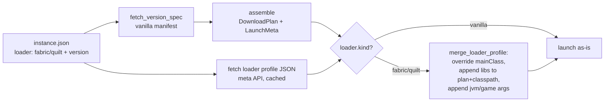

# Fabric + Quilt launch (Phase 4, slice A)

## Problem

The New Instance modal already lets a user pick a `fabric` or `quilt` loader build
(`getLoaders` → `loaders::for_mc`), and `instance.json` records `loader: { kind, version }`.
But `launch_instance` ignores the loader entirely — it always resolves and launches **vanilla**.
A Fabric/Quilt instance launches as plain Minecraft, with no loader on the classpath, so no
mods could ever load. Phase 4's first slice closes that gap for the two meta-API loaders
(Fabric, Quilt), which need no installer jar.

## Goals / Non-goals

- **Goals:** A created Fabric *or* Quilt instance launches to the main menu. The loader's
  `mainClass`, libraries, and extra JVM/game arguments are applied on top of the resolved
  vanilla manifest. Vanilla launch is unchanged.
- **Non-goals:** NeoForge + Forge (need a maven/installer-jar runner — separate slice). Mod
  installation/management (Phase 5). SHA verification of loader libraries (Fabric/Quilt meta
  ships no hash in the profile; deferred — see Open questions). Pre-1.7 legacy launch (already
  deferred). UI changes (the create + launch UI already exist and are loader-agnostic).

## How loader launch works

Fabric and Quilt expose a **profile JSON** in the standard Mojang launcher format at:

- Fabric: `https://meta.fabricmc.net/v2/versions/loader/{mc}/{loader}/profile/json`
- Quilt:  `https://meta.quiltmc.org/v3/versions/loader/{mc}/{loader}/profile/json`

The profile **inherits from** the vanilla version (`inheritsFrom: "1.21.1"`). It does *not*
repeat vanilla's libraries or assets. It contributes only three things:

1. `mainClass` — the loader entrypoint (e.g. `net.fabricmc.loader.impl.launch.knot.KnotClient`).
2. `libraries` — loader + intermediary + dependency jars, in **Maven-coordinate form**
   (`{ "name": "net.fabricmc:fabric-loader:0.16.10", "url": "https://maven.fabricmc.net/" }`),
   **not** Mojang's `downloads.artifact` shape. No `sha1`, no `size`, no full `path`.
3. `arguments.jvm` / `arguments.game` — extra args to append (modern format only).

So the resolved launch = **vanilla manifest as base**, then: override `mainClass`, append loader
libraries to the download plan + classpath, append loader arguments. `java_major`, asset index,
natives, logging — all stay from vanilla.

Resolved launch = vanilla base + loader overlay:

### Maven coordinate → path/url

A loader library `name` is a Maven coordinate `group:artifact:version[:classifier]`:

- `net.fabricmc:fabric-loader:0.16.10`
  → path `net/fabricmc/fabric-loader/0.16.10/fabric-loader-0.16.10.jar`
  → url  `{base url}` + path  (base from the lib's `url` field, e.g. `https://maven.fabricmc.net/`)
- Optional 4th segment is a classifier → `...-{version}-{classifier}.jar`.

The vanilla `select_classpath` path uses Mojang's explicit `downloads.artifact.path`; loader libs
have no such field, so the path is **derived from the coordinate**. This is the one genuinely new
parsing primitive.

## Approaches

| # | Approach | Pros | Cons |
|---|----------|------|------|
| A | **Inherit + merge** — resolve vanilla, fetch loader profile, override mainClass, append libs/args | Matches how Fabric/Quilt meta is designed; reuses all vanilla plumbing; pure mergeable; no installer JVM | Must derive maven path/url from coords; loader libs unverified (no sha1 in profile) |
| B | Run the Fabric/Quilt installer jar | "Official" path | Needs a JVM to run the installer before launch; heavyweight; same machinery as Forge — defeats "meta-API loaders are the simplest" sequencing |
| C | Hardcode the known loader library set | No network parse | Brittle, version-specific, breaks on every loader release |

## Recommendation

**Approach A — inherit + merge.** Evidence:

- `resolver::assemble` (`resolver.rs:571`) already produces `(DownloadPlan, LaunchMeta)` with
  `main_class`, `classpath` (client jar last), `jvm_args`/`game_args` as plain `Vec<String>` — all
  appendable/overridable without a shape change.
- `DownloadItem` (`download.rs`) has `expected_hash: Option<ExpectedHash>` and `size: Option<u64>`,
  so loader libs with **no hash** are already representable.
- `meta::cached_text` (`meta.rs`) is the existing fetch+disk-cache primitive — reused for the
  profile, exactly as `loaders.rs` already does for the build lists.
- `LaunchMeta` is `Serialize`-camelCase; appending to existing `Vec` fields and overriding
  `main_class` keeps the serialized shape identical → **no `ipc.ts` change**.

Approach B is the Forge/NeoForge path and is deliberately deferred. Approach C is rejected outright.

## Open questions

- **Loader-library hash verification.** The profile carries no sha1/size, so loader jars download
  unverified (HTTPS-only integrity). Fabric publishes `.sha1` sibling files on its maven; fetching
  them is possible but adds a request per lib. Deferred — filed as a follow-up rather than scoped
  here. Acceptable for a launch-to-main-menu slice.
- **Duplicate libraries.** A loader lib could in theory collide with a vanilla lib on the
  classpath. In practice the inherited profile lists only loader-specific libs, so collisions are
  not expected. De-dup is not in scope; Minecraft tolerates duplicate classpath entries.
- **`inheritsFrom` vs `instance.minecraft`.** We drive the MC version from `instance.minecraft`
  (already used to pick the loader build), not from the profile's `inheritsFrom`. They should
  always agree because the modal filters loader builds to the chosen MC. Not validated against
  each other in this slice.
