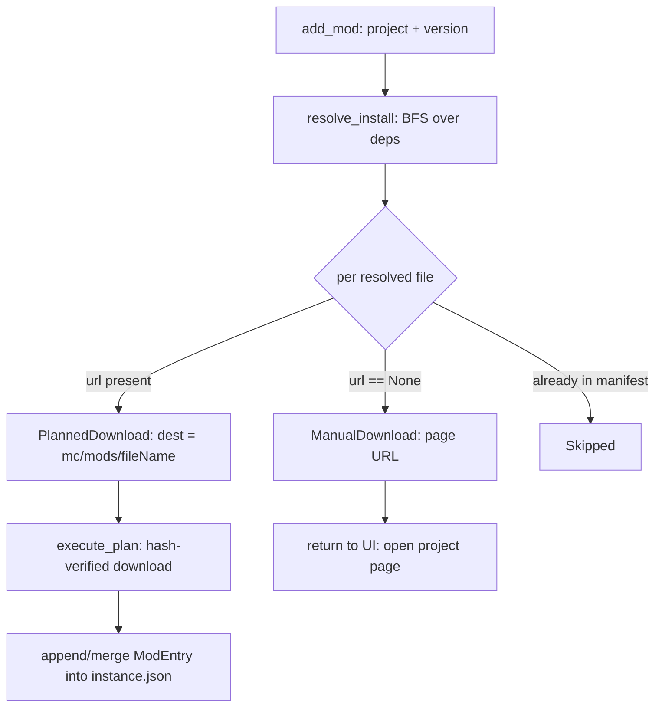

# Mod install (Phase 5 slice B)

## Problem

Browse (slice A) can search both providers and list versions, but a user cannot yet
*install* a mod into an instance. Slice B closes that loop: pick a mod → resolve its
required dependencies → download the jars into the instance → track them in the manifest →
let the user enable/disable/update/remove them. CurseForge authors can disable
distribution (`allowModDistribution:false`); those mods must degrade to an "open the
project page and drop the file in manually" prompt instead of failing.

Build the **Modrinth path first** (no API key). CurseForge rides the same code path; it
only needs the pending API key to start returning data. Nothing in slice B is
Modrinth-specific by design — the `ModProvider` trait and normalized types already unify
both backends.

## Goals / Non-goals

- **Goals**
  - Add a mod (by project + chosen version) from a provider to an instance.
  - Resolve and install transitive **required** dependencies automatically.
  - Surface **optional** dependencies as non-blocking suggestions; warn on **incompatible**.
  - Enable / disable an installed mod (file-suffix convention, no re-download).
  - Update an installed mod to the newest compatible version.
  - Remove an installed mod (file + manifest entry).
  - Distribution-disabled files (`VersionFile.url == None`) degrade to a manual-download
    prompt carrying a project-page URL, never a hard failure of the whole operation.
- **Non-goals**
  - Modpack import (`.mrpack` / CF zip) — Phase 6.
  - CF fingerprint matching / "detect unmanaged jar's provider" — later.
  - Background "updates available" polling / batch update-all — single-mod update only.
  - Cross-provider dependency resolution (a Modrinth mod depending on a CF project). Deps
    are resolved within the originating provider only.
  - Mod-side filtering (client/server) beyond storing the declared `side`.

## Domain model

A mod install is two separable concerns: **planning** (pure, network-fed, deterministic
given provider responses) and **execution** (download bytes + mutate manifest/disk).
Splitting them is the central design decision — it makes the hard logic (dependency BFS,
version selection, manual-fallback partition, dedup) testable through the existing
injectable `ProviderHttpClient` mock with zero live network, mirroring how `resolver.rs`
is tested against fixtures.

Conceptual flow of `add_mod`:

### Where mods live

Mods are **per-instance**, downloaded straight into `<instances>/<slug>/mc/mods/<fileName>`.
No shared cache / hardlink dedup (unlike libraries) — mods are user-curated per instance,
typically small, and `scan_mods` already reads this exact folder. Reusing the materialize
hardlink path would add complexity for no dedup benefit at slice-B scope.

### Enable / disable

Reuse the existing `scan_mods` convention: a disabled mod's file gets a `.disabled`
suffix appended (`sodium.jar` → `sodium.jar.disabled`). `ModEntry.enabled` flips to match.
No re-download. `file_name` in the manifest always stores the base `.jar` name.

### Dependency resolution

BFS from the chosen version's `dependencies[]`:

- `required` → resolve the dependency project to its newest version compatible with the
  instance's `minecraft` + `loader`, take its primary file, recurse.
- `optional` → collected as suggestions, **not** auto-installed.
- `incompatible` → collected as warnings.
- `embedded` → ignored (shipped inside the parent jar).

Cycle/dup guard: a `visited` set keyed on `project_id`. A dependency already present in the
instance manifest (by `project_id`) is skipped. A dependency may be declared by
`version_id` directly (use it) or only `project_id` (resolve newest compatible).

"Newest compatible" = first entry returned by `get_versions(project_id, mc_version, loader)`
whose `files[]` has a primary file (providers return newest-first; Modrinth by date desc).
If no compatible version exists, the dependency becomes an `Unresolved` entry surfaced to
the UI rather than aborting the whole install.

### Manual-download fallback

When a resolved file has `url == None`, it cannot be auto-downloaded. The planner emits a
`ManualDownload { file_name, page_url, provider, project_id }`. The UI opens `page_url` in
the system browser; the user drops the jar into `mc/mods/` manually, after which
`scan_mods` surfaces it as an unmanaged mod.

Project-page URL construction needs the project **slug**, which `ProjectVersion` does not
carry. The add flow originates from Browse, where the `ProjectSummary` (with `slug`) is in
hand — the slug is threaded into `add_mod` from the caller. For a dependency resolved by id
only, the slug may be absent; in that case `page_url` falls back to the provider's
id-based URL form. See Open questions.

## Approaches

| # | Approach | Pros | Cons |
|---|----------|------|------|
| A | Split planner (pure, mock-testable) + thin executor; new `core/mod_install.rs` | Hard logic unit-tested w/o network; matches resolver/auth test pattern; CF rides same path | One more module |
| B | One monolithic `add_mod` command doing resolve+download+write inline | Fewer files | Untestable without live HTTP; mixes IO with logic; hard to extend for update |
| C | Resolve deps in the frontend (TS), backend just downloads a flat list | Thin backend | Duplicates provider logic in TS; dependency BFS in two languages; drifts |

## Recommendation

**Approach A.** The injectable `ProviderHttpClient` seam already exists precisely so
resolution logic can be tested against canned responses (`providers.rs:169`, mirrored from
`auth.rs:226`). A pure planner returning a structured `InstallPlan` keeps dependency BFS,
version selection, dedup, and manual partitioning fully unit-testable, and gives `update_mod`
a reusable resolution entry point. Execution (download + manifest write) stays a thin
orchestration layer over the existing `download::execute_plan` and `instances` manifest
helpers. CF needs no special-casing: same trait, same normalized types — only the API key
gates its data.

## Open questions

- **CF manual-download page URL by id only.** When a distribution-disabled CF dependency is
  reached via `project_id` without a slug, the best we can build is an id-based URL. Modrinth
  accepts `https://modrinth.com/mod/{id}`; CF's canonical page is slug-based
  (`/minecraft/mc-mods/{slug}`) — id-based CF URLs are not guaranteed to resolve. Acceptable
  for slice B (Modrinth-first; CF distribution-disabled is rarer and the top-level add always
  has a slug); revisit when CF data is live. Tracked as a follow-up rather than a blocker.
- **"Newest compatible" tie-break.** Relying on provider return order (newest-first). If a
  provider ever returns unordered results, add an explicit date sort. No evidence either
  provider does today.
