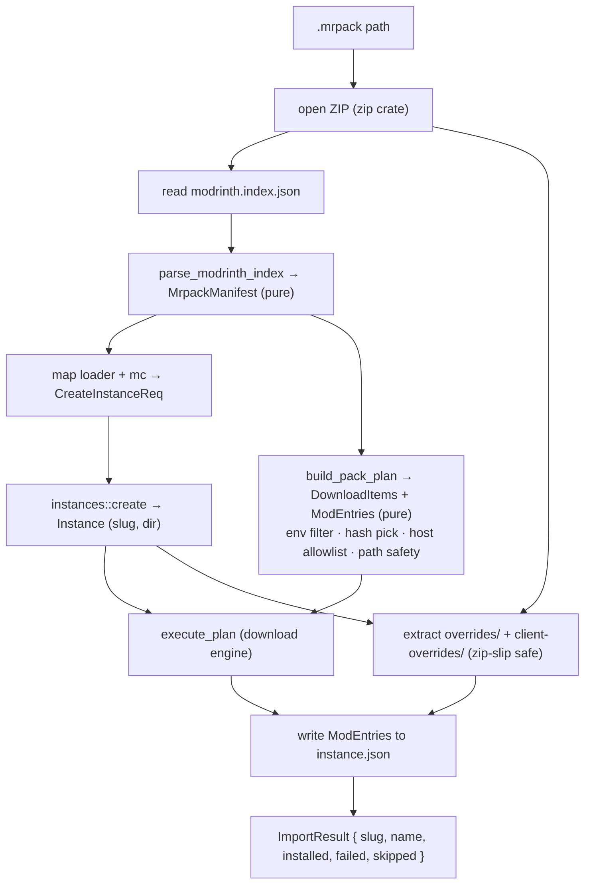
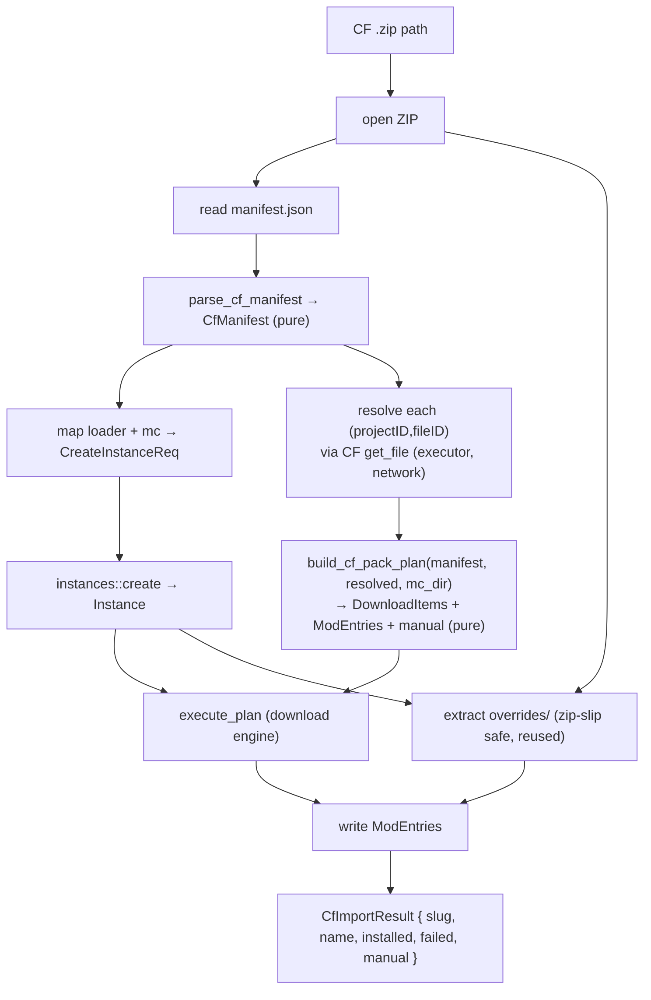

# Modpack import (Phase 6)

## Why

Phase 6 is the headline feature: install a complete modpack — loader, mods, configs,
resource packs — from a single file or one click, instead of adding mods one at a time
(Phase 5). A pack is a curated, versioned bundle; importing one must reproduce the author's
intended instance faithfully and safely.

Two pack ecosystems matter:

- **Modrinth `.mrpack`** — a ZIP with a JSON index (`modrinth.index.json`) listing files by
  direct download URL + hashes, plus an `overrides/` tree copied verbatim. Self-describing,
  no API key, deterministic. **Simplest — slice A.**
- **CurseForge `.zip`** — a ZIP with `manifest.json` listing files by `(projectID, fileID)`,
  no direct URLs. Each file's download URL must be resolved through the CF API, and some
  files have distribution disabled (`allowModDistribution:false`) → manual download. **Slice B.**

Beyond local-file import: browse & one-click-install packs from both providers (slice C),
and update/re-resolve an installed pack to a newer version (slice D).

## Scope by slice

| Slice | Scope | Headlessly testable? |
|-------|-------|----------------------|
| **A** | Local `.mrpack` import → new instance (parse, download, overrides) | Yes — fixture zip, pure parse/plan |
| B | Local CF `.zip` import → CF per-file URL resolution + manual surfacing | Yes — fixture zip + mock provider |
| C | Browse packs (CF `classId=4471`, Modrinth `project_type:modpack`) + one-click install | Backend yes; UI no (GUI) |
| D | Pack update / re-resolve (diff installed vs new index) | Yes — fixture diffs |

This doc details **slices A and B**; C–D get their own sections when reached.

## `.mrpack` format (slice A ground truth)

A `.mrpack` is a ZIP. Relevant entries:

- `modrinth.index.json` (root, required):
  - `formatVersion` (int, currently `1`), `game` (`"minecraft"`), `name`, `versionId`, optional `summary`
  - `dependencies`: map of `{ "minecraft": "<mc>", "<loader-key>": "<loaderVersion>" }`.
    Loader keys: `fabric-loader`, `quilt-loader`, `forge`, `neoforge`.
  - `files[]`: each `{ path, hashes: { sha1, sha512 }, env?: { client, server }, downloads: [url, …], fileSize }`
- `overrides/` (optional): tree copied verbatim into the instance's `mc/` directory.
- `client-overrides/` (optional): client-only overrides — **applied** (we are a client launcher).
- `server-overrides/` (optional): **ignored**.

### Behavior rules

- **Loader mapping:** `fabric-loader`→`fabric`, `quilt-loader`→`quilt`, `forge`→`forge`,
  `neoforge`→`neoforge`; absence of any loader key → `vanilla`. `dependencies.minecraft` is
  the MC version. Loader `version` = the dependency value.
- **Env filter:** skip a file whose `env.client == "unsupported"`. Server-only files never
  install. Absent `env` ⇒ treated as client-supported.
- **Hash pick:** prefer `sha512`, else `sha1`, mapped to `ExpectedHash`; never `None` (mrpack
  always supplies hashes — a missing hash is a malformed pack and is rejected).
- **Download host allowlist (security):** Modrinth's spec restricts `downloads` URLs to a
  fixed set of trusted hosts (`cdn.modrinth.com`, `github.com`, `raw.githubusercontent.com`,
  `gitlab.com`). A URL whose host is not on the allowlist aborts the import — an arbitrary URL
  in an untrusted pack is a code-execution vector (it lands a jar on the classpath).
- **Path safety (zip-slip + index paths):** every `files[].path` and every override entry
  name must be a relative path with no `..` component and no absolute/drive-letter prefix,
  resolved strictly under the instance `mc/` dir. Anything escaping is rejected.
- **Mod entries:** files under `mods/` are recorded as `ModEntry` (provider `"modrinth"`,
  empty `project_id`/`version_id` — mrpack carries only URL+hash, not project ids; `side`
  from `env`). Non-`mods/` files (configs, resourcepacks) download to their path with no
  manifest entry; `scan_mods` reconciliation still sees jars on disk. Provider-id-based
  update of mrpack-imported mods is out of scope until slice D.

## Architecture (slice A)

Mirror the mod-install split: a **pure core** (`core/modpack.rs`) that parses + plans with no
I/O, and a **thin executor** (the `import_mrpack` command in `lib.rs`) that does zip reads,
instance creation, downloads, and overrides extraction. The pure core is unit-tested against
JSON/zip fixtures with zero network — same discipline as `resolver.rs`, `mod_install.rs`.

Caption: slice-A `.mrpack` import — pure parse/plan feeds the executor that creates the
instance, downloads files, and applies overrides.

## CurseForge `.zip` format (slice B ground truth)

A CF pack is a ZIP. Relevant entries:

- `manifest.json` (root, required):
  - `manifestType` (`"minecraftModpack"`), `manifestVersion` (int), `name`, `version`, `author`
  - `minecraft`: `{ version: "<mc>", modLoaders: [ { id: "<loader>-<ver>", primary: bool }, … ] }`.
    The primary entry's `id` encodes loader + version: `forge-47.2.0`, `neoforge-21.1.65`,
    `fabric-0.15.11`, `quilt-…`. Loader kind = prefix before first `-`; loader version = rest.
  - `files[]`: each `{ projectID, fileID, required }`. **No URL, no hash, no filename** — those
    are resolved per file through the CF API.
- `overrides/` (optional, name set by `overrides` key, default `"overrides"`): tree copied
  verbatim into the instance's `mc/` directory. CF packs use one overrides dir (no client/server split).

### Behavior rules (slice B)

- **Loader mapping:** split `modLoaders[].id` (the `primary` one) on the first `-` → kind
  (`forge`/`neoforge`/`fabric`/`quilt`) + version. No loader entry → `vanilla`.
  `minecraft.version` is the MC version.
- **Per-file resolution:** for each `files[]` entry, resolve `(projectID, fileID)` through the
  CF API to a download URL + filename + hash + size. Unlike mrpack, the manifest carries none
  of this — resolution is mandatory and is the slice's defining work.
- **Distribution-disabled files (`allowModDistribution:false`):** CF returns `downloadUrl: null`
  for these (already mapped to `url: None` in `curseforge.rs`). They cannot be auto-downloaded;
  surface them as **manual** entries (project page link + filename) for the user to drop in —
  reusing the manual-download concept from `mod_install.rs`. A manual file does NOT abort the
  import; the rest installs and the user is told what to fetch.
- **Hash pick:** CF file records expose hashes (`hashes[]` with algo 1=sha1, 2=md5) — prefer
  sha1 → `ExpectedHash::Sha1`. If a resolved file has no usable hash, download unverified is
  unacceptable for an arbitrary jar, so treat as manual (link the page) rather than fetch blind.
- **Path safety:** files install under `mc/mods/<fileName>` (CF mods always go to `mods/`);
  override entries validated the same zip-slip-safe way as slice A. No host allowlist needed —
  download URLs come from the CF CDN via the authenticated API, not from the untrusted manifest.
- **Mod entries:** each installed file → `ModEntry` (provider `"curseforge"`, `project_id` =
  `projectID`, `version_id` = `fileID` — CF packs DO carry ids, so slice-D update can re-resolve).

### File-resolution approaches (the slice's one real decision)

| # | Approach | Sketch | Cost | Risk |
|---|----------|--------|------|------|
| A | Single-file GET per entry: add `get_file(projectID, fileID)` to CF provider using the existing GET seam | reuses `ProviderHttpClient::get`; N requests for N files; mirrors `get_versions` parsing | med | low — slow for big packs (~100 req), but pack import is one-shot |
| B | Batch `POST /v1/mods/files` with `{fileIds:[…]}` | one request resolves all files | low latency | med — needs a POST method on the GET-only HTTP seam; new response shape |
| C | Reuse `get_versions(projectID)` then filter to `fileID` | no new endpoint | low code | high — fetches every version of every mod, wasteful, still N requests |

**Recommendation: Approach A.** Adds one focused method (`get_file`) on the existing GET seam,
mock-testable exactly like `get_versions`, no trait/seam widening mid-slice. Pack import is a
one-time operation where total latency matters far less than in interactive search; the N-request
cost is acceptable. Batch resolution (B) is a clean slice-D optimization once the POST seam is
justified by more than one caller. C is rejected — it pulls whole version histories to find one file.

## Architecture (slice B)

Same pure-core / thin-executor split as slice A. The new wrinkle: planning needs data that only
the network has (resolved URLs), so resolution sits between parse and plan. Parse and plan stay
pure and fixture-tested; the executor owns the CF API calls and feeds resolved files into the
pure planner.

Caption: slice-B CF `.zip` import — parse stays pure; the executor resolves each file's URL via
the CF API, then the pure planner builds the download plan + manual list.

## Rejected approaches

- **Stream-download during parse (no plan).** Couples network to parsing; untestable without
  live HTTP and can't validate the whole pack (host allowlist, path safety) before writing
  anything. Rejected for the pure-planner split.
- **Reuse `mod_install::resolve_install` for packs.** That resolver does provider-API
  dependency BFS by project id; mrpack files are pre-resolved URLs with no ids and no deps to
  walk. Different problem — a separate planner is simpler and honest.
- **Parse the zip in the frontend.** Duplicates format logic in TS and hands raw URLs to the
  backend to fetch — loses the host allowlist guarantee. Backend owns the file end to end.

## Open questions

- Multiple `downloads[]` URLs per file: take the first allowlisted, or try in order on
  failure? Slice A: first allowlisted; fail the file if its host is disallowed. Revisit if
  packs commonly list fallback mirrors.
- `overrides/` colliding with a downloaded file path: last-writer. Slice A applies overrides
  **after** downloads so author overrides win (matches Modrinth/Prism behavior).
