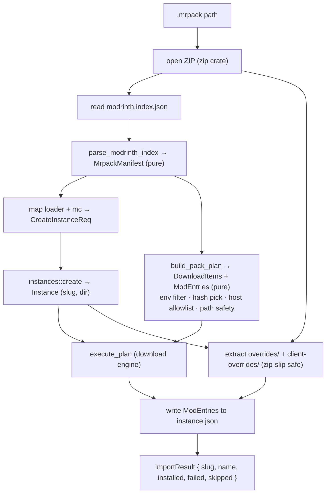
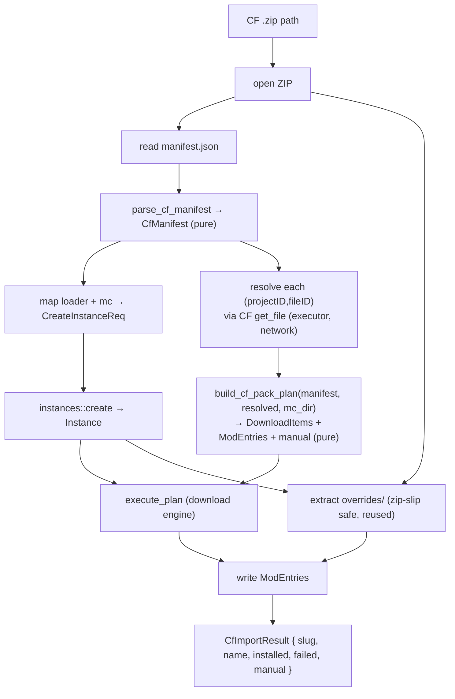
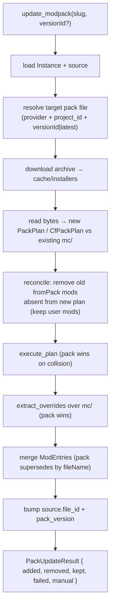

# Modpack import (Phase 6)

## Why

Phase 6 is the headline feature: install a complete modpack — loader, mods, configs,
resource packs — from a single file or one click, instead of adding mods one at a time
(Phase 5). A pack is a curated, versioned bundle; importing one must reproduce the author's
intended instance faithfully and safely.

Two pack ecosystems matter:

- **Modrinth `.mrpack`** — a ZIP with a JSON index (`modrinth.index.json`) listing files by
  direct download URL + hashes, plus an `overrides/` tree copied verbatim. Self-describing,
  no API key, deterministic. **Simplest — slice A.**
- **CurseForge `.zip`** — a ZIP with `manifest.json` listing files by `(projectID, fileID)`,
  no direct URLs. Each file's download URL must be resolved through the CF API, and some
  files have distribution disabled (`allowModDistribution:false`) → manual download. **Slice B.**

Beyond local-file import: browse & one-click-install packs from both providers (slice C),
and update/re-resolve an installed pack to a newer version (slice D).

## Scope by slice

| Slice | Scope | Headlessly testable? |
|-------|-------|----------------------|
| **A** | Local `.mrpack` import → new instance (parse, download, overrides) | Yes — fixture zip, pure parse/plan |
| B | Local CF `.zip` import → CF per-file URL resolution + manual surfacing | Yes — fixture zip + mock provider |
| C | Browse packs (CF `classId=4471`, Modrinth `project_type:modpack`) + one-click install | Backend yes; UI no (GUI) |
| D | Pack update / re-resolve (diff installed vs new index) | Yes — fixture diffs |

This doc details **slices A and B**; C and D have their own sections below.

## `.mrpack` format (slice A ground truth)

A `.mrpack` is a ZIP. Relevant entries:

- `modrinth.index.json` (root, required):
  - `formatVersion` (int, currently `1`), `game` (`"minecraft"`), `name`, `versionId`, optional `summary`
  - `dependencies`: map of `{ "minecraft": "<mc>", "<loader-key>": "<loaderVersion>" }`.
    Loader keys: `fabric-loader`, `quilt-loader`, `forge`, `neoforge`.
  - `files[]`: each `{ path, hashes: { sha1, sha512 }, env?: { client, server }, downloads: [url, …], fileSize }`
- `overrides/` (optional): tree copied verbatim into the instance's `mc/` directory.
- `client-overrides/` (optional): client-only overrides — **applied** (we are a client launcher).
- `server-overrides/` (optional): **ignored**.

### Behavior rules

- **Loader mapping:** `fabric-loader`→`fabric`, `quilt-loader`→`quilt`, `forge`→`forge`,
  `neoforge`→`neoforge`; absence of any loader key → `vanilla`. `dependencies.minecraft` is
  the MC version. Loader `version` = the dependency value.
- **Env filter:** skip a file whose `env.client == "unsupported"`. Server-only files never
  install. Absent `env` ⇒ treated as client-supported.
- **Hash pick:** prefer `sha512`, else `sha1`, mapped to `ExpectedHash`; never `None` (mrpack
  always supplies hashes — a missing hash is a malformed pack and is rejected).
- **Download host allowlist (security):** Modrinth's spec restricts `downloads` URLs to a
  fixed set of trusted hosts (`cdn.modrinth.com`, `github.com`, `raw.githubusercontent.com`,
  `gitlab.com`). A URL whose host is not on the allowlist aborts the import — an arbitrary URL
  in an untrusted pack is a code-execution vector (it lands a jar on the classpath).
- **Path safety (zip-slip + index paths):** every `files[].path` and every override entry
  name must be a relative path with no `..` component and no absolute/drive-letter prefix,
  resolved strictly under the instance `mc/` dir. Anything escaping is rejected.
- **Mod entries:** files under `mods/` are recorded as `ModEntry` (provider `"modrinth"`,
  empty `project_id`/`version_id` — mrpack carries only URL+hash, not project ids; `side`
  from `env`). Non-`mods/` files (configs, resourcepacks) download to their path with no
  manifest entry; `scan_mods` reconciliation still sees jars on disk. Provider-id-based
  update of mrpack-imported mods is out of scope until slice D.

## Architecture (slice A)

Mirror the mod-install split: a **pure core** (`core/modpack.rs`) that parses + plans with no
I/O, and a **thin executor** (the `import_mrpack` command in `lib.rs`) that does zip reads,
instance creation, downloads, and overrides extraction. The pure core is unit-tested against
JSON/zip fixtures with zero network — same discipline as `resolver.rs`, `mod_install.rs`.



Caption: slice-A `.mrpack` import — pure parse/plan feeds the executor that creates the
instance, downloads files, and applies overrides.

## CurseForge `.zip` format (slice B ground truth)

A CF pack is a ZIP. Relevant entries:

- `manifest.json` (root, required):
  - `manifestType` (`"minecraftModpack"`), `manifestVersion` (int), `name`, `version`, `author`
  - `minecraft`: `{ version: "<mc>", modLoaders: [ { id: "<loader>-<ver>", primary: bool }, … ] }`.
    The primary entry's `id` encodes loader + version: `forge-47.2.0`, `neoforge-21.1.65`,
    `fabric-0.15.11`, `quilt-…`. Loader kind = prefix before first `-`; loader version = rest.
  - `files[]`: each `{ projectID, fileID, required }`. **No URL, no hash, no filename** — those
    are resolved per file through the CF API.
- `overrides/` (optional, name set by `overrides` key, default `"overrides"`): tree copied
  verbatim into the instance's `mc/` directory. CF packs use one overrides dir (no client/server split).

### Behavior rules (slice B)

- **Loader mapping:** split `modLoaders[].id` (the `primary` one) on the first `-` → kind
  (`forge`/`neoforge`/`fabric`/`quilt`) + version. No loader entry → `vanilla`.
  `minecraft.version` is the MC version.
- **Per-file resolution:** for each `files[]` entry, resolve `(projectID, fileID)` through the
  CF API to a download URL + filename + hash + size. Unlike mrpack, the manifest carries none
  of this — resolution is mandatory and is the slice's defining work.
- **Distribution-disabled files (`allowModDistribution:false`):** CF returns `downloadUrl: null`
  for these (already mapped to `url: None` in `curseforge.rs`). They cannot be auto-downloaded;
  surface them as **manual** entries (project page link + filename) for the user to drop in —
  reusing the manual-download concept from `mod_install.rs`. A manual file does NOT abort the
  import; the rest installs and the user is told what to fetch.
- **Hash pick:** CF file records expose hashes (`hashes[]` with algo 1=sha1, 2=md5) — prefer
  sha1 → `ExpectedHash::Sha1`. If a resolved file has no usable hash, download unverified is
  unacceptable for an arbitrary jar, so treat as manual (link the page) rather than fetch blind.
- **Path safety:** files install under `mc/mods/<fileName>` (CF mods always go to `mods/`);
  override entries validated the same zip-slip-safe way as slice A. No host allowlist needed —
  download URLs come from the CF CDN via the authenticated API, not from the untrusted manifest.
- **Mod entries:** each installed file → `ModEntry` (provider `"curseforge"`, `project_id` =
  `projectID`, `version_id` = `fileID` — CF packs DO carry ids, so slice-D update can re-resolve).

### File-resolution approaches (the slice's one real decision)

| # | Approach | Sketch | Cost | Risk |
|---|----------|--------|------|------|
| A | Single-file GET per entry: add `get_file(projectID, fileID)` to CF provider using the existing GET seam | reuses `ProviderHttpClient::get`; N requests for N files; mirrors `get_versions` parsing | med | low — slow for big packs (~100 req), but pack import is one-shot |
| B | Batch `POST /v1/mods/files` with `{fileIds:[…]}` | one request resolves all files | low latency | med — needs a POST method on the GET-only HTTP seam; new response shape |
| C | Reuse `get_versions(projectID)` then filter to `fileID` | no new endpoint | low code | high — fetches every version of every mod, wasteful, still N requests |

**Recommendation: Approach A.** Adds one focused method (`get_file`) on the existing GET seam,
mock-testable exactly like `get_versions`, no trait/seam widening mid-slice. Pack import is a
one-time operation where total latency matters far less than in interactive search; the N-request
cost is acceptable. Batch resolution (B) is a clean slice-D optimization once the POST seam is
justified by more than one caller. C is rejected — it pulls whole version histories to find one file.

## Architecture (slice B)

Same pure-core / thin-executor split as slice A. The new wrinkle: planning needs data that only
the network has (resolved URLs), so resolution sits between parse and plan. Parse and plan stay
pure and fixture-tested; the executor owns the CF API calls and feeds resolved files into the
pure planner.



Caption: slice-B CF `.zip` import — parse stays pure; the executor resolves each file's URL via
the CF API, then the pure planner builds the download plan + manual list.

## Browse → one-click install (slice C ground truth)

Slices A/B import a **local archive the user already picked**. Slice C starts from a
`ProjectSummary` in the Browse feed (provider + project id + `projectType: Modpack`) and has
no file on disk. The only new work is **acquiring the archive**: resolve the project's latest
pack file, download it, then hand the bytes to the *exact same* parse/plan/extract path A/B
already prove.

### What a "modpack file" is per provider

- **Modrinth:** a modpack project's latest version has a primary file that is the `.mrpack`
  (`VersionFile.primary == true`, `url` always present — Modrinth distributes packs directly).
  → feed bytes to the slice-A path (`read_mrpack` + overrides).
- **CurseForge:** a modpack project (`classId=4471`) latest version has a primary file that is
  the pack `.zip`. CF *pack* files are normally distributable, but `url` can be `None`
  (`allowModDistribution:false`). No url → cannot auto-install → surface manual (open
  `page_url`), same fallback shape as a distribution-disabled mod inside a CF pack.
  → feed bytes to the slice-B path (`read_cf_manifest` + `resolve_and_build_cf_plan` + overrides).

### The one real refactor

Both executors today are `read file → bytes → [6-step body on bytes]`. The body never touches
the path again after step 1. So extract the body into a bytes-taking inner function; the
existing file-picker commands and the new provider command both call it. No logic duplicated,
no behavior change to A/B.

```
import_mrpack(path)            → read file → import_mrpack_from_bytes(bytes, name?)
import_curseforge_zip(path)    → read file → import_cf_zip_from_bytes(bytes, name?)
install_modpack(provider, id)  → resolve latest pack file → download archive → dispatch:
                                   modrinth  → import_mrpack_from_bytes
                                   curseforge→ import_cf_zip_from_bytes
```

### Acquire-archive flow (the new code)

1. `get_versions(client, project_id, None, None)` (no mc/loader filter — the pack *defines*
   those). Pick the **latest** version (provider returns newest-first; if ordering is not
   guaranteed, sort by date). Pick the primary file (`files.iter().find(|f| f.primary)`,
   else first).
2. If the file `url` is `None` → return a manual-download outcome carrying `page_url`. (CF only.)
3. Download the archive to `cache/installers/<fileName>` (helper exists: `cache_installers_dir`).
   Plain `reqwest` GET to bytes/file — single URL, no plan engine needed. Cache hit on
   re-install of the same file is a free bonus, not a requirement.
4. Read the staged bytes and dispatch to the matching `*_from_bytes` inner fn.

### Result shape

The two import paths already return distinct structs (`MrpackImportResult` vs `CfImportResult`
— the latter carries `manual[]`). `install_modpack` returns a **tagged union** so the frontend
renders the right toast without re-deriving the provider. A third variant covers the
"pack file itself is not distributable" manual case.

### UI

`ModpackCard` in `Browse.tsx` gains an **Install** action (primary) alongside the existing
"open page" (secondary). Click → `install_modpack` mutation (TanStack) → completion toast
reusing the existing import-result toast pattern from `Home.tsx`. Live per-file progress is
**out of scope** for slice C (executors already run with `NoOpSink`); the button shows a
pending state and a result toast. Live progress is a follow-up.

## Pack update (slice D ground truth)

Slices A–C *install* a pack into a fresh instance. Slice D *updates* an already-installed
pack: re-resolve it against a newer (or user-chosen) pack version and re-apply, keeping the
user's own additions. Plus two supporting features: **user-chosen version** at install/update
time (deferred from slice C), and **Pack Lock** (a per-instance toggle that freezes a pack as
the author shipped it).

### The provenance prerequisite

`Instance.source: Option<Source> { provider, project_id, file_id, pack_version }` already
exists in the manifest but **is never populated** — `instances::create` sets `source: None`
and no import/install executor writes it. Update is impossible without it: an instance has no
record of which pack it came from.

**Only the Browse one-click path can supply provenance.** Re-resolving a pack needs its provider
*pack project id* — and only `install_modpack` has it (the user clicked a `ProjectSummary`). The
**local-file** import paths do not: a `.mrpack` carries no project/version ids at all (slice A
records empty ids), and a CF `manifest.json` carries per-mod `projectID`s but no top-level *pack*
project id. So:

- `install_modpack` (Browse) populates `source` with the resolved `{ provider, project_id,
  file_id, pack_version }` → the instance is **updatable**.
- Local-file imports (`import_mrpack` / `import_curseforge_zip` from the NewInstanceModal Import
  tab) leave `source: None` → **not updatable** (no Update action shown). This is honest: there
  is no pack id to re-resolve from.

Mechanically, the shared `*_from_bytes` inner fns gain an optional source parameter: the Browse
caller passes `Some(source)`, the local-file commands pass `None`. Independently, **`fromPack`**
(below) is set `true` on every pack-imported `ModEntry` on *both* paths — it marks pack-managed
content regardless of update-ability (inert when `source` is `None`, since no update runs).

Consequence: only packs installed via Browse *after* this slice ships can be updated; everything
else has `source: None`. Acceptable — there is no data to backfill from.

No `SCHEMA_VERSION` bump is needed: `fromPack`/`packLocked` are purely additive serde-default
fields, never read as a gate on existing data, so old manifests deserialize unchanged.

### Distinguishing pack content from user content

On update we must remove pack mods that disappeared between versions, but **never** touch mods
the user added by hand (Phase 5 `add_mod`). Both are `ModEntry`s with provider + ids — today
they are indistinguishable. Add a serde-defaulted `fromPack: bool` to `ModEntry`: import/install
set it `true`; `add_mod` leaves it `false`. Backward-compatible — old manifests deserialize with
`fromPack = false`, and those instances have `source: None` anyway, so they are never updated.

### Merge semantics — "pack wins, preserve unconflicting user content"

The user chose **pack wins on collision, preserve user files the new pack does not overwrite**
(applies to mods, `options.txt`, and `config/`). Realized as an **overlay re-install**, not a
structured byte-diff:

1. Resolve the target pack version (latest, or user-chosen `versionId`). Download + read the
   archive → new `PackPlan` (mrpack) / `CfPackPlan` (CF) against the instance's existing `mc/`.
2. **Reconcile mods.** `old_pack_mods` = current `ModEntry`s with `fromPack == true`.
   `new_pack_mods` = the new plan's mod entries (all `fromPack`). For every old pack mod whose
   `fileName` is absent from the new plan → delete its jar from `mc/mods/` (both `<name>` and
   `<name>.disabled`) and drop its `ModEntry`. User mods (`fromPack == false`) are never removed.
3. **Apply the new plan.** `execute_plan` downloads the new files — collisions overwrite (pack
   wins). Write the new pack `ModEntry`s (`fromPack = true`). The merged `mods[]` is keyed by
   `fileName`: a new pack entry **replaces** any existing entry (user or old-pack) with the same
   `fileName` — one record per filename, `fromPack = true` for the winner. User entries whose
   `fileName` the pack does not name are kept verbatim.
4. **Overlay overrides.** `extract_overrides` re-applies `overrides/` over `mc/` — collisions
   overwrite (pack wins on configs/options). Files the user added that the pack does not name
   are left in place.
5. Bump `source.file_id` + `source.pack_version` to the target.



Caption: slice-D update — overlay re-install; pack content reconciled by `fileName`, user
content preserved unless the pack overwrites it.

`PackUpdateResult` is **one struct** for both providers: `{ added, removed, kept, failed,
manual: Vec<CfManualFile> }`. `manual` is empty for mrpack updates and carries
distribution-disabled files for CF updates (same `CfManualFile` shape slice B surfaces). One
result type keeps the frontend toast provider-agnostic.

**Known limitation (documented, not fixed):** override files removed *between* pack versions
linger, because the manifest tracks no per-file override provenance (only mod jars are recorded
as `ModEntry`s). A config the old pack shipped and the new one dropped stays on disk. Acceptable
for slice D; a per-file override ledger is a follow-up.

### User-chosen version (folded in from slice C)

Slice C always installs the latest version. Slice D adds a version picker:

- **Backend:** parameterize the pack-file resolver with an optional target version id (`None` =
  latest = first returned, the slice-C behavior). `install_modpack` and `update_modpack` both
  take `versionId: Option<String>`. The dropdown's data is the existing `get_mod_versions`
  provider command (a modpack project's versions) — no new list endpoint.
- **Frontend:** a version dropdown on the Browse `ModpackCard` (install) and in `InstanceDetail`
  (update). Default selection = latest.

### Pack Lock

A per-instance **Pack Lock** (`Instance.pack_locked: bool`, serde-default `false`) freezes a pack
as installed. It is a *feature*, not a gate on the merge logic:

- When locked, the "Manage installs" mutation actions (add / remove / enable / disable / update
  mod) are disabled in the UI, and **every** backend mod-mutation command (`add_mod`,
  `set_mod_enabled`, `remove_mod`, `update_mod`) rejects with a clear error (defense-in-depth —
  fail loud, not cosmetic-only). The guard covers the full `mods/`-mutating command surface.
- Update is still allowed while locked (updating *is* the sanctioned way to change a locked
  pack). Toggling the lock is a dedicated command.
- Naming: "Pack Lock" is the working label (the user asked for a name distinct from "content
  lock"); final UI copy is a review detail.

### Approaches — update mechanism

| # | Approach | Sketch | Cost | Risk |
|---|----------|--------|------|------|
| A | Overlay re-install on the existing instance | resolve new version → read pack → reconcile `fromPack` mods (remove vanished) → `execute_plan` (pack wins) → overlay overrides → bump source | med | low — reuses A/B/C plan + `*_from_bytes` seams |
| B | Structured byte-diff old plan vs new plan | persist/re-resolve the old manifest, compute add/remove/upgrade deltas, apply minimal changes | high | med — needs the old pack manifest stored or re-fetched; more logic, more failure modes |
| C | Uninstall + fresh reinstall into the same slug | wipe pack content, reinstall from scratch | med | high — destroys user additions + edited configs; violates the chosen "preserve" semantics |

**Recommendation: A.** The current `ModEntry` list (filtered by `fromPack`) *is* the old-version
record, so no old manifest needs storing or re-fetching (kills B's main cost). Overlay-write with
pack-wins-on-collision is exactly the chosen merge semantics, and it reuses the proven
`build_pack_plan` / `resolve_and_build_cf_plan` / `extract_overrides` / `*_from_bytes` seams. C is
rejected — it destroys the user content the requirement says to preserve.

### Out of scope (slice D) — explicit deferrals

- **Rollback** of a half-populated instance on mid-update/import failure
  (`modpack-import-partial-cleanup`) — still a follow-up; not pulled into this slice.
- **Batch CF resolution** (`POST /v1/mods/files`) — still a follow-up; the `ProviderHttpClient`
  seam stays GET-only this slice. Update re-resolves CF files one GET each, like slice B import.
- **Per-file override provenance** (to delete configs dropped between versions) — follow-up.

## Rejected approaches

- **Stream-download during parse (no plan).** Couples network to parsing; untestable without
  live HTTP and can't validate the whole pack (host allowlist, path safety) before writing
  anything. Rejected for the pure-planner split.
- **Reuse `mod_install::resolve_install` for packs.** That resolver does provider-API
  dependency BFS by project id; mrpack files are pre-resolved URLs with no ids and no deps to
  walk. Different problem — a separate planner is simpler and honest.
- **Parse the zip in the frontend.** Duplicates format logic in TS and hands raw URLs to the
  backend to fetch — loses the host allowlist guarantee. Backend owns the file end to end.

## Open questions

- Multiple `downloads[]` URLs per file: take the first allowlisted, or try in order on
  failure? Slice A: first allowlisted; fail the file if its host is disallowed. Revisit if
  packs commonly list fallback mirrors.
- `overrides/` colliding with a downloaded file path: last-writer. Slice A applies overrides
  **after** downloads so author overrides win (matches Modrinth/Prism behavior).
- (slice C) `get_versions` ordering: is the newest version guaranteed first for both
  providers? If not, sort by a version date field before picking latest. Verify against a live
  response; until then, sort defensively.
- (slice C) Version selection: slice C installs the **latest** version only. User-chosen
  version (a version dropdown on the card) is deferred — it folds naturally into slice D
  (update/re-resolve), which already needs version-diffing.
