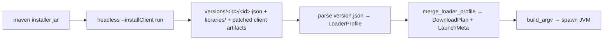

# NeoForge + Forge launch (Phase 4 slice B)

## Problem

Fabric/Quilt launch shipped via pure-JSON loader profiles merged into the vanilla
launch plan. NeoForge and Forge cannot reuse that path directly: they distribute an
**installer jar** whose processors binary-patch the vanilla client jar. Without the
patched artifacts the game cannot start. The launcher must produce those artifacts,
then launch through the same merged-profile plumbing.

Conceptual flow (one-time install per loader version, then normal launch):

## Evidence (verified 2026-06-09, /gather-evidence)

| Fact | Source |
|------|--------|
| Installer zip root holds `install_profile.json` (processors) + `version.json` (launch profile) | downloaded NeoForge 26.1.2.75 + 21.1.115, Forge 1.21.11-61.1.8 installers; unzipped |
| Client-side processors mandatory: produce patched client (`client.lzma` binpatch → `minecraft-client-patched`) | parsed `install_profile.json` of all three |
| Processor pipeline format varies across versions (10 procs on 21.1.x, 2 on 26.x) | same |
| `--installClient <dir>` headless path: downloads vanilla jar, writes `versions/<id>/<id>.json` + `libraries/`, runs processors | `neoforged/legacyinstaller` `SimpleInstaller.java` + `ClientInstall.java` |
| ClientInstall refuses to run without `launcher_profiles.json` in target dir | `ClientInstall.java` |
| `version.json` shape: `inheritsFrom` vanilla id, own `mainClass`, 26–52 extra libraries, extra JVM/game args | parsed |
| Repos: `maven.neoforged.net/releases/...` (NeoForge), `maven.minecraftforge.net/...` (Forge, no `/releases` prefix) | curl |
| Prism uses ForgeWrapper (separate jar running installer logic at launch); recurring breakage on format shifts | PrismLauncher org repos / issues |

## Goals / Non-goals

- **Goals:** a NeoForge or Forge instance (no mods) launches end to end; install step
  is one-time per loader version and shared across instances; install progress
  surfaces in the UI; loader versions already listed by `loaders.rs` become launchable.
- **Non-goals:** legacy Forge < 1.13 (pre-processor format); server installs; mod
  loading (Phase 5); reimplementing processors; supporting custom mavens/mirrors.

## Approaches

| # | Approach | Pros | Cons |
|---|----------|------|------|
| A | Headless official installer run | Supported path; format-churn-proof (installer matches its own profile format); reuses `ensure_java` + fabric/quilt merge seam | Installer owns its downloads (coarse progress); needs dummy `launcher_profiles.json`; ~1 min one-time step |
| B | Reimplement processor pipeline in Rust | Full control, fine-grained progress | High cost; breaks on format churn (Prism's wrapper history proves it); big test surface |
| C | ForgeWrapper at launch time | Battle-tested in Prism | Third-party jar dep; opaque failures; wrapper needs updates anyway |
| D | Prism meta server profiles | Pre-digested JSON | External service dependency; still doesn't produce patched client without processors |

## Recommendation

**A — headless installer.** The installer is the only artifact guaranteed to match its
own profile format across the version range users pick. We already provision Java
(`core/java.rs ensure_java`) and already have the loader-profile merge seam
(`resolver.rs merge_loader_profile`, `loader_profile.rs`). The produced
`versions/<id>/<id>.json` is structurally a superset of the fabric profile JSON —
parse it into the same `LoaderProfile` type and the rest of the pipeline is shared.

Key integration facts:

- Install target dir must look like a `.minecraft`: seed `launcher_profiles.json`
  (`{"profiles":{}}`) before running. Use the app-data dir so `libraries/` is shared
  with vanilla launches.
- Forge/NeoForge `version.json` JVM args use placeholders the vanilla set lacks:
  `${library_directory}`, `${classpath_separator}`, `${version_name}` —
  `build_argv` must substitute them.
- Some profile libraries have no download URL (produced locally by processors) —
  resolver must treat empty-URL libraries as classpath-only entries, not downloads.
- Installer stdout/stderr streams to a new, distinct `install://log` event (not the
  game-log or `download://progress` channels — installer output is log-shaped, not
  item-progress-shaped) so the user sees install progress; completion detected by
  exit code + presence of `versions/<id>/<id>.json`.

## Open questions

- Re-run policy: if a later launch finds the loader's `version.json` present but a
  library file missing, re-run installer vs fail loud? Leaning: re-run once, then
  fail loud.
- Disk layout: installer writes `versions/<id>/` alongside our instance layout —
  acceptable, or remap into `meta-cache/`? Leaning: accept `.minecraft`-style layout
  in app-data root; it is what the installer supports.
