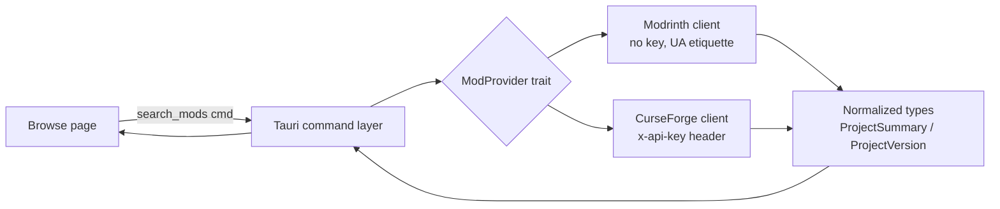

# Providers: browse & add mods (Phase 5)

## Problem

Users can create and launch vanilla/Fabric/Quilt/Forge/NeoForge instances, but mods only
arrive by manual jar drop-in. Phase 5 makes content discoverable and installable in-app:
search Modrinth + CurseForge, pick a version compatible with the instance, download into
`mods/`, and manage what's installed. This is also the substrate Phase 6 (modpack import)
builds on — pack resolution consumes the same provider clients and normalized types.

A search flows through one normalized pipeline regardless of provider:

## Goals / Non-goals

**Goals**

- Modrinth + CurseForge clients behind one `ModProvider` trait; UI and (later) pack
  resolver never branch on provider for common shapes.
- Unified Browse page: search, provider filter, MC version + loader facets, infinite scroll.
- Add a mod to an instance with required-dependency resolution; enable/disable/update.
- CF `allowModDistribution:false` / `downloadUrl:null` surfaces as open-project-page +
  manual drop-in, never a silent failure (CF API terms forbid proxying disabled files).
- CF API key stays backend-side (`settings.json` field exists: `settings.rs:31`), never in
  the frontend bundle.

**Non-goals**

- Modpack import / `.mrpack` / CF zip (Phase 6 — but normalized types must not preclude it).
- Resource packs, shaders, datapacks (mods only; `classId`/`project_type` filter fixed to mods).
- Jar fingerprint reconciliation of manually added mods (Murmur2 / sha512 lookup — Phase 6+).
- Provider account auth (CF/Modrinth user accounts).

## Business rules / invariants

- A mod install is recorded in `instance.json` (`ModEntry`, `instances.rs:51`) **and** lands
  as a file in `mc/mods/`; the existing folder-reconciliation view (`FolderMod`) shows both
  tracked and untracked jars.
- Version compatibility = instance's MC version ∈ `game_versions` AND instance's loader ∈
  `loaders`. Forge/NeoForge are distinct loaders (CF mixes them into `gameVersions[]` —
  parse carefully).
- Required dependencies install transitively; optional dependencies are offered, not forced.
- Disabled mod = file renamed `<name>.jar.disabled` (Prism convention), `enabled:false` in
  `ModEntry`. No deletion on disable.
- CF key absent → CF search degrades gracefully (provider tab shows "key required" state,
  Modrinth still works). Never a hard error on Browse mount.

## Approaches

| # | Approach | Pros | Cons |
|---|----------|------|------|
| A | Rust-side `ModProvider` trait + normalized domain types; thin unified Tauri commands; frontend provider-agnostic | Matches PROVIDERS.md:50-68 sketch; CF key never leaves backend; Phase 6 pack resolver reuses clients + types in Rust; testable with the repo's mock-HTTP convention | Normalization quirks (CF `gameVersions` mixing) solved in Rust where iteration is slower |
| B | Thin per-provider Rust passthrough; normalize in TypeScript | Faster UI iteration on shapes | Duplicates normalization for Phase 6 (pack resolver is Rust); two sources of truth; more `ipc.ts` drift surface |
| C | Frontend fetches provider APIs directly from the webview | No IPC layer at all | CF key in the bundle (forbidden); CORS; UA etiquette uncontrollable; rejected outright |

## Recommendation

**A.** PROVIDERS.md already prescribes normalized Rust shapes ("the UI and pack resolver
don't branch on provider", PROVIDERS.md:52); the roadmap requires the CF key backend-side
(ROADMAP.md Phase 5); and Phase 6's pack resolution ("parse index → DownloadPlan") consumes
`Vec<VersionFile>` in Rust. B and C both fork normalization or leak the key.

Sub-decisions, with evidence:

| Decision | Choice | Why |
|----------|--------|-----|
| HTTP seam | New injectable `ProviderHttpClient` trait (async_trait), like `AuthHttpClient` (`auth.rs:226`) — **not** `meta::cached_text` | `cached_text` (`meta.rs:33`) is GET-text + 6h disk cache keyed by filename: no headers (CF needs `x-api-key`), and search queries are parameterized — disk-caching them explodes keys and staleness. All 226 existing tests are mock-HTTP; this keeps the convention. |
| Caching | None for search; TanStack Query (30s staleTime, `query.ts`) is the cache | Search is interactive; double-caching adds invalidation bugs for ~zero win. Stable lookups (versions list) can adopt short disk TTL later if rate limits bite — noted as a risk, not built now. |
| CF key resolution | `settings.curseforge_api_key` (exists, `settings.rs:31`) with `MODLOADER_CF_API_KEY` env override | Mirrors the `ms_client_id()` pattern (`auth.rs:28`): env for dev/CI, settings for users. |
| Pagination | Normalize to `offset`/`limit` + `total` | Modrinth is offset/limit natively; CF `index`/`pageSize` maps 1:1. |
| "All providers" tab | Two independent paginated queries rendered side-by-side per provider; no interleaved merge | Merging two cursors into one ranked stream has no stable sort key (downloads counts aren't comparable cross-provider) — cost outweighs value for v1. Tabs: All (both columns) / Modrinth / CurseForge. |
| Command errors | `ProviderCommandError { kind, message }` | Mirrors `AuthCommandError` (`lib.rs:29`) — the established error-to-frontend shape. |

## Slices

| Slice | Scope | Spec |
|-------|-------|------|
| A — providers-browse | Trait + both clients + search/versions commands + Browse UI (read-only discovery) | `docs/spec/providers-browse.md` |
| B — mod-install | Add-to-instance, dependency resolution, enable/disable/update, CF manual fallback UI | `docs/spec/mod-install.md` (authored after slice A ships) |

Slice A ends runnable: search both providers, filter, scroll. Slice B makes results actionable.

## Open questions

- Modrinth rate limiting under fast typing: debounce (400ms) planned; is that enough without
  a backend limiter? Watch during slice A manual verify.
- CF loader facet for Quilt: CF `modLoaderType` enum supports Quilt=5, but coverage is thin —
  does an empty Quilt+CF result need special empty-state copy?
- Update-check UX (slice B): per-mod "update available" badge needs a versions fetch per
  installed mod — batch endpoint vs lazy per-row fetch undecided until slice B planning.
