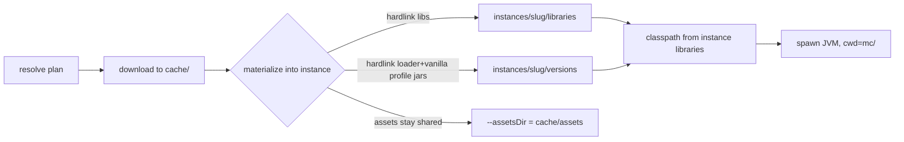

# Storage, branding, and auth reorganization (ApexLauncher)

## Problem

The launcher (working name "modloader") has accreted three structural issues that are
biting during real testing:

1. **Data root is unbranded and identifier-coupled.** It lands under the reverse-DNS
   bundle id (`com.bear.modloader`) because path resolution uses Tauri's
   `app_data_dir()`, which appends the identifier. The product should own a friendly,
   stable folder name (`ApexLauncher`) independent of the bundle id.
2. **Multi-account is over-built for the product.** There is a full accounts store,
   active-account selection, and an Accounts page. The product wants exactly one
   Microsoft account: log in, stay logged in across restarts, log out. The extra
   surface is dead weight and a source of bugs.
3. **Instances are not self-contained.** Assets and libraries are already shared at the
   data root (`<data>/assets`, `<data>/libraries`), but an instance folder is not a
   portable, isolated game tree — the classpath points straight at the shared library
   store, and there is no `cache/` boundary separating downloaded content from instances.

This is a pre-alpha (v0.1.0) reorg. No migration of existing `com.bear.modloader` data.

## Goals / Non-goals

**Goals**
- Branded, identifier-independent data root named `ApexLauncher` under OS-native appdata.
- A clean `cache/` (shared, dedup) vs `instances/` (per-instance, isolated) split.
- Each instance is a self-contained game tree whose libraries/loader are materialized via
  **hardlinks** from the shared cache (near-zero extra disk; copy fallback cross-volume).
- Single Microsoft account: login/logout control bottom-left in the sidebar; persistent
  across restarts (refresh token in OS keyring, profile in `account.json`).
- Full rebrand of user-facing names + bundle identifier.

**Non-goals**
- Migrating old `com.bear.modloader` data (pre-alpha; fresh start).
- Multi-account, account switching, or offline/cracked accounts.
- Changing the download engine, resolver logic, or loader-install mechanics beyond where
  artifacts land and how they are materialized into an instance.
- Repo/package rename (`modloader` crate name, repo dir) — out of scope; only the
  product-facing identity and data paths change.

## Current state (grounded)

| Concern | Today | Source |
|---------|-------|--------|
| Data root | `app_data_dir()` → `.../com.bear.modloader/` | `store.rs:14` |
| Instances | `<data>/instances/<slug>/` ; game dir `mc/` ; `natives/` per-instance | `store.rs:21`, `launch.rs:78-80` |
| Assets | shared `<data>/assets/` (`--assetsDir`) | `launch.rs:79` |
| Libraries | shared `<data>/libraries/`, classpath points directly at it | `launch.rs:228` |
| Java | shared `<data>/java/` | `store.rs:31` |
| Meta/installer cache | `<data>/meta-cache/`, `<data>/installer-cache/` | signals, `forge_installer.rs` |
| Accounts | `<data>/accounts.json` multi-store + active-account | `store.rs:41`, `auth.rs` |
| Auth commands | `begin_login`, `cancel_login`, `list_accounts`, `remove_account`, `set_active_account` | `lib.rs` |
| UI | `/accounts` route + `Accounts.tsx`; nav item in `Sidebar.tsx` | `router.tsx:18`, `Sidebar.tsx:8` |
| Branding | `productName`/`identifier`/window title `modloader`; sidebar text "Modloader" | `tauri.conf.json`, `Sidebar.tsx:20` |

Key fact: **assets and libraries are already shared** — slice C is about introducing the
`cache/` boundary and per-instance *materialization*, not about un-duplicating storage.

## Target on-disk layout

```text
<OS-appdata-base>/ApexLauncher/
  account.json                 # single MS account profile (refresh token → OS keyring)
  cache/                       # shared, dedup, network-sourced; safe to wipe
    assets/                    # content-addressed objects/<hash> + indexes (read-only)
    libraries/                 # maven-layout jar store; hardlink source
    versions/                  # vanilla + loader profile JSONs (forge/neoforge/fabric/quilt)
    java/                      # downloaded JREs (<major>/)
    meta/                      # version/loader metadata 6h cache (was meta-cache/)
    installers/                # forge/neoforge installer jars (was installer-cache/)
  instances/
    <slug>/
      instance.json
      libraries/               # hardlinked subset from cache/libraries (this instance's classpath)
      versions/                # hardlinked loader/vanilla profile + jars for this instance
      natives/                 # extracted per-instance (unchanged)
      mc/                      # game working dir (--gameDir): mods/ saves/ config/ resourcepacks/
```

OS appdata bases (Tauri `path().data_dir()`, then `.join("ApexLauncher")`):
- Windows: `%APPDATA%\ApexLauncher`
- macOS: `~/Library/Application Support/ApexLauncher`
- Linux: `~/.local/share/ApexLauncher`

## Materialization model

The flow that makes an instance launchable, given a resolved `DownloadPlan` + `LaunchMeta`:



Caption: download lands in shared `cache/`; libraries and loader/version jars are hardlinked
into the instance so its classpath is self-contained; assets are referenced from the shared
content-addressed store rather than materialized (see Open questions).

**Hardlink semantics:** `std::fs::hard_link(cache_path, instance_path)`. On failure (cross-
volume, unsupported FS), fall back to a byte copy. Hardlinks share inodes — re-materializing
an unchanged instance is idempotent and free. The instance's `libraries/` and `versions/`
are rebuilt-if-missing on each launch from the resolved plan, so they self-heal.

## Approaches

### Slice C — what gets materialized into the instance

| # | Approach | Pros | Cons |
|---|----------|------|------|
| A | Hardlink **libraries + loader/version jars**; keep **assets shared** via `--assetsDir` | Self-contained classpath; near-zero disk; assets are read-only + content-addressed so isolating them buys nothing; few hundred link ops | Instance is not 100% self-contained (assets live in cache) |
| B | Hardlink **everything** incl. full asset object store per instance | Literally "all game files in the instance folder" | Thousands of link ops per launch; no isolation benefit (assets read-only); churn |
| C | No materialization — classpath points at shared `cache/libraries` (≈ today) | Simplest; zero link ops | Instance not portable/isolated; defeats the stated goal |

**Recommendation: A.** It delivers the isolation the goal actually needs (a self-contained
classpath, a portable instance for mods/config/saves/loader) at near-zero cost, and treats
the shared asset store the way every mainstream launcher does. B technically matches the
literal "copy all game files" phrasing but spends thousands of link operations per launch to
isolate read-only content that gains nothing from isolation. This is the one place the design
deviates from the literal request; flagged in Open questions for confirmation.

### Slice B — single-account persistence

| # | Approach | Pros | Cons |
|---|----------|------|------|
| A | `account.json` profile + refresh token in OS keyring; commands `begin_login`/`cancel_login`/`logout`/`get_account` | Reuses existing keyring seam; secret stays out of plaintext; minimal new surface | Requires gutting multi-account store + 3 commands |
| B | Single `account.json` holding everything incl. refresh token | Simplest | Refresh token in plaintext on disk — regression vs current keyring use |

**Recommendation: A.** Keeps the keyring discipline already built and tested; the reorg is
a reduction (remove list/remove/set-active + Accounts page), not a security downgrade.

### Slice A — data root resolution

Replace `app_data_dir()` (identifier-appended) with `path().data_dir()?.join("ApexLauncher")`
in `store.rs::data_dir`. Every other path helper derives from `data_dir`, so the rename
propagates from one function. Add `cache_dir()` and adjust `java_dir`, meta, installer, and
the per-instance helpers to the new layout.

## Sequencing

Slices are coupled through `store.rs` paths and must land in order:

1. **A (rebrand + data root + cache/ layout)** — foundation; all paths move here.
2. **B (single-account)** — independent logic, but rebases on A's `store.rs`.
3. **C (instance materialization)** — depends on A's `cache/` split.

One spec, checkpoints grouped A→B→C, each ending green and committable.

## Open questions

- **Assets materialization (Recommendation A vs B).** Design recommends keeping the
  content-addressed asset store shared (`--assetsDir → cache/assets`) rather than hardlinking
  thousands of asset objects into each instance. This is the only deviation from the literal
  "all game files copied into the instance" request. Confirm A, or require full B.
- **Loader "separately installed" interpretation.** Recommendation installs loader artifacts
  once into shared `cache/` (idempotent, dedup) and hardlinks them into the instance, giving a
  per-instance materialized view. If the intent is a literally independent installer run per
  instance (duplicated jars), that changes the forge/neoforge installer target dir.
- **Window default size.** Current window is 800×600 — small for a launcher with a sidebar +
  Browse grid. Out of scope unless desired; noted because the rebrand touches the same config.
