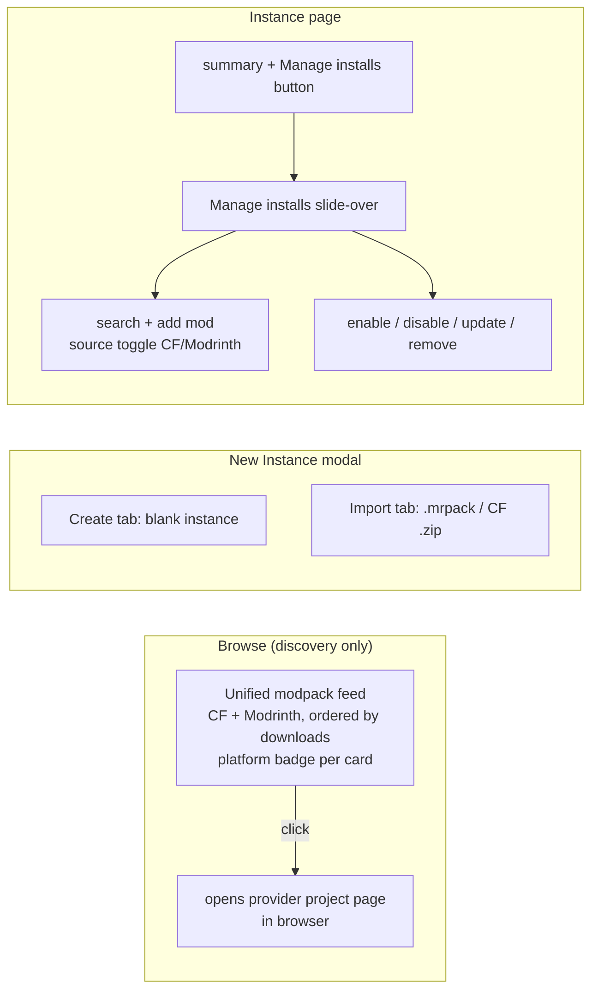

# UI / modpack-flow rework

## Problem

The launcher's discovery and install flows are split awkwardly:

- **Browse** searches *mods* in a side-by-side CurseForge | Modrinth two-column layout. There is no way to discover *modpacks* — the thing a new user actually wants first.
- **Modpack import** lives as two buttons (`.mrpack`, CurseForge `.zip`) on the Instances list header, disconnected from instance creation.
- **Adding a mod to an instance** happens from the global Browse page via an `AddToInstanceModal` (pick a target instance), which is backwards: the user is usually *in* an instance and wants to add to *it*.
- The window opens at a cramped fixed 800×600.

Net effect: the two-column "compare providers" framing dominates the UI, modpack discovery is absent, and mod management is scattered across three routes.

## Goals / Non-goals

- **Goals**
  - Browse shows **modpacks** (not mods), from both providers in **one ordered feed** with a per-item platform indicator. No more side-by-side columns.
  - Modpack **import** moves off the Instances list into the **New Instance** UI.
  - Mod **add / enable / disable / update / remove** consolidates into a per-instance **"Manage installs" slide-over**, with a CurseForge/Modrinth source toggle for adding.
  - Window opens **maximized** (fills the monitor working area; OS chrome retained; not borderless fullscreen).
  - General visual modernization carried by the new slide-over + badge components and the larger canvas.
- **Non-goals**
  - **Installing a modpack directly from Browse.** Browse is discovery-only: clicking a result opens its provider project page in the browser. The user downloads the pack, then imports it via New Instance. (No download-from-provider backend work this pass.)
  - No new provider, no auth change, no generated IPC types (still hand-mirrored `ipc.ts`).
  - No change to the modpack *importer* internals (`core/modpack.rs`) or the mod *installer* (`core/mod_install.rs`) — only where their entry points are surfaced in the UI.

## Flow — before vs after

Discovery and install routing after the rework. Browse is read-only discovery; install and management live where the user already is.

## Key constraint — provider search is mod-only today

Both providers hardcode the *mod* project type:

- `core/modrinth.rs:166` — facet `["project_type:mod"]` always injected.
- `core/curseforge.rs:273` — `classId = MODS_CLASS_ID` (6) in the search URL.

To search modpacks the search path needs a **project-type selector** threaded from the Tauri command down through `SearchParams` into both implementations:

| Project type | Modrinth facet | CurseForge classId |
|--------------|----------------|--------------------|
| mod (existing) | `project_type:mod` | `6` |
| modpack (new) | `project_type:modpack` | `4471` |

## Page URL for discovery-only Browse

`ProjectSummary` carries `slug` + `provider` but **no page URL**. Clicking a card must open the provider page. Constructing the URL client-side is brittle — CurseForge's path segment varies (`/minecraft/modpacks/<slug>` vs `/minecraft/mc-mods/<slug>`), and the slug normalization differs per provider.

**Recommendation:** add a normalized `page_url: Option<String>` field to `ProjectSummary`, populated at normalization time:

- Modrinth: the search response is missing a direct URL but the `project_type` + `slug` map deterministically (`https://modrinth.com/{project_type}/{slug}`). Modrinth's type segment is stable.
- CurseForge: the search response already includes `links.websiteUrl` — use it verbatim. No guessing.

This keeps URL construction next to the per-provider raw shapes where the knowledge lives, and the frontend just opens `page_url`.

## Approaches

### Unified feed ordering across two paginated providers

| # | Approach | Pros | Cons |
|---|----------|------|------|
| A | Fetch a page from each provider, concat + sort by downloads desc client-side, dedupe by `provider:id`; infinite scroll advances both offsets | Simple; reuses existing per-provider paginated `searchMods`; "roughly popularity-ordered" reads naturally | Ordering is per-loaded-buffer, not globally exact; a low-download CF pack on page 1 can sort above a high-download Modrinth pack still on page 2 |
| B | New backend command that queries both providers and merges server-side | Single ordered stream | New command, new pagination model, more backend surface — over-scoped for discovery-only |
| C | Keep two columns but relabel to modpacks | Tiny change | Violates the explicit "one ordered feed" requirement |

**Recommendation: A.** Discovery-only Browse does not need exact global ordering. Per-buffer merge-sort by downloads is the cheapest path that satisfies "in order with a little indicator," and it reuses the existing `searchMods` pagination untouched.

### CF-key-missing behavior in the unified feed

CurseForge search needs an API key; Modrinth does not. In the old two-column layout each column showed its own error. In a merged feed a missing CF key must **not** suppress Modrinth results.

**Recommendation:** query each provider independently (two `useInfiniteQuery` hooks feeding one merged list). If CF errors with `key_missing`, render Modrinth hits normally plus a small dismissible inline notice ("CurseForge results hidden — add an API key in Settings"). Modrinth-only is a valid feed.

### Window sizing

`maximized: true` in the `tauri.conf.json` window config opens filling the monitor working area while keeping OS chrome — matches "size of the monitor, not fullscreen." Pair with a `minWidth`/`minHeight` floor so the responsive layout never collapses below its breakpoints.

## Open questions

- None blocking. Visual polish specifics (spacing, badge styling) are left to the implementer within the "modernize" intent — success criteria gate behavior, not pixels.
