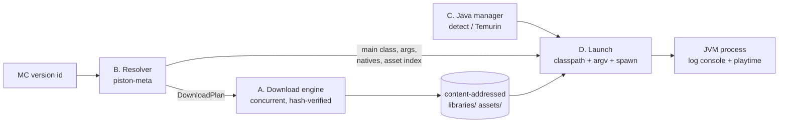

# Vanilla Minecraft install + launch (Phase 2)

## Problem

The launcher can pick a Minecraft version and loader build (metadata is wired into the
create-instance flow) but cannot install or run anything. No game files are downloaded, no
JRE is managed, no JVM is spawned. Phase 2 closes that gap for **vanilla** (no loader, no
mods, no online auth): a created instance installs its files and launches to the main menu.

This is the riskiest phase — auth, loaders, and pack import all hang off a working launch.
It is built as four independently-testable slices behind one design so the contracts
between them are fixed before code lands.

The pipeline, end to end:

Caption: resolver turns a version id into a DownloadPlan the engine executes into the
content-addressed store; launch combines resolved metadata + Java + downloaded files into a
spawned JVM.

## Goals / Non-goals

**Goals**
- Download engine: concurrent, hash-verified, content-addressed, resumable, progress events.
- Vanilla resolver: full piston-meta version manifest → `DownloadPlan` + launch metadata.
- Java manager: detect system JREs, download Temurin per required major.
- Launch: build classpath, extract natives, substitute arg placeholders, spawn JVM, stream
  logs to an in-app console, record playtime on exit.
- **Done when:** a vanilla instance launches and reaches the main menu.

**Non-goals (this phase)**
- Online auth — Phase 3. Launch uses offline/demo identity (placeholder name + uuid).
- Mod loaders (Fabric/Forge/etc.) — Phase 4. Resolver handles vanilla manifest only.
- Mods / providers / pack import — Phase 5/6.
- `rustls` migration — tracked for Phase 7 CI; stay on `native-tls` now (flagged as risk).
- Generated TS types (specta/ts-rs) — cross-cutting; `ipc.ts` stays hand-mirrored.

## Slices

| Slice | What | Depends on | Isolation test |
|-------|------|-----------|----------------|
| A | Download engine — execute a `DownloadPlan` | nothing | local mock HTTP server |
| B | Vanilla resolver — piston-meta → `DownloadPlan` + launch meta | A (consumes plan), `meta.rs` | recorded JSON fixtures |
| C | Java manager — detect/download Temurin per major | A | mock Adoptium responses |
| D | Launch — classpath + natives + argv + spawn + logs + playtime | A+B+C | end-to-end smoke |

The **plan/execute seam** (resolver produces `DownloadPlan`; engine executes it) is the
load-bearing decision: it lets the resolver be tested with fixtures (assert the produced
plan) and the engine be tested with a mock server (assert it fetches+verifies), without
either needing the other. `ARCHITECTURE.md` §5 already names this seam.

## Approaches

Per-slice decisions where more than one option is real.

### A. Download engine — concurrency model

| # | Approach | Pros | Cons |
|---|----------|------|------|
| A1 | `tokio::sync::Semaphore` + `futures::stream::buffer_unordered` over the plan | async-native (Tauri already runs tokio); bounded; cancellable; streams chunks for progress | needs `stream` reqwest feature + `futures-util` |
| A2 | OS thread pool (`std::thread` + blocking reqwest) | simple mental model | second runtime alongside tokio; blocking I/O wastes the async runtime |
| A3 | External crate (e.g. a downloader lib) | less code | opaque retry/verify semantics; harder to match our hash/dedupe rules |

**Pick A1.** Tauri already drives tokio; a semaphore bounds in-flight requests (~8–16) and
`buffer_unordered` gives natural concurrency with backpressure. Hash is computed
incrementally as chunks stream in, so verification costs no extra read.

### B. Resolver — manifest fetch + caching

Reuse `meta.rs::cached_text` (TTL'd disk cache) for the per-version manifest and asset
index. Piston-meta version JSON is immutable per id → cache key = version id; TTL can be
long. Parse into typed structs (libraries with rules/natives, `assetIndex`, `downloads`,
`mainClass`, `arguments`). Produce a `DownloadPlan` whose dest paths follow the
content-addressed layout (Maven path for libraries, `assets/objects/<2hex>/<sha1>` for
asset objects).

### C. Java manager — provisioning

| # | Approach | Pros | Cons |
|---|----------|------|------|
| C1 | Detect system JREs first, download Temurin only if no match | smaller footprint; respects user installs | detection is OS-specific and fuzzy |
| C2 | Always download Temurin per major | deterministic; no detection guesswork | gigabytes per major; ignores existing JREs |

**Pick C1 with C2 fallback.** Probe common locations + `JAVA_HOME` + `PATH` for a JRE whose
major matches the version's `javaVersion.majorVersion`; if none, download Temurin from the
Adoptium API into `<data>/java/<major>/`. Engine (A) does the download + hash-verify.

### D. Launch — process model + log transport

| # | Approach | Pros | Cons |
|---|----------|------|------|
| D1 | `std::process::Command` + reader threads → Tauri events (`launch://log`) | works with std; threads isolate blocking stdio | manual thread join on exit |
| D2 | `tokio::process::Command` + async stdout/stderr → events | async-native; integrates with engine runtime | child-process stdio piping across platforms is fiddlier |

**Lean D2**, decide at slice D. Either way: spawn with `mc/` as cwd, substitute argv
placeholders (`${classpath}`, `${natives_directory}`, `${auth_player_name}`, …), stream
stdout/stderr lines as events to an in-app console, track PID, record `lastPlayed` +
`totalPlaytimeSec` on exit.

## Recommendation

Build in slice order A → B → C → D. A is the foundation everything fetches through and is
the cleanest to test in isolation, so it lands first. B and C both depend only on A and
could parallelize, but serial keeps reviewer loops small. D integrates all three and is the
only slice that needs an end-to-end run.

Content-addressing lives in the **dest paths the resolver chooses**, not the engine: the
engine's dedupe rule is simply "if the dest file already exists and its hash matches the
expected hash, skip the download." This keeps the engine generic (it doesn't know Maven
layout or asset-object layout) and testable without any Minecraft knowledge.

## Open questions

- **Asset index size:** vanilla asset indexes list ~thousands of objects. Does the engine
  need plan chunking / streaming to avoid building one giant in-memory plan? (Defer to B —
  the resolver decides plan granularity; A just executes whatever list it's handed.)
- **Resumable across app restarts:** range-resume within a run is in scope (A). Persisting
  partial-download state across launches is not — `.part` files + range on retry cover the
  common case. Confirm that's enough.
- **Offline identity:** what placeholder uuid/name does vanilla launch use pre-auth? Decide
  at D (Phase 3 replaces it).
- **`native-tls` on Linux/Windows CI:** OpenSSL build dep. Flagged; migration deferred to
  Phase 7. Does dev on Linux already hit this? (Out of scope here; noted in risks.)
