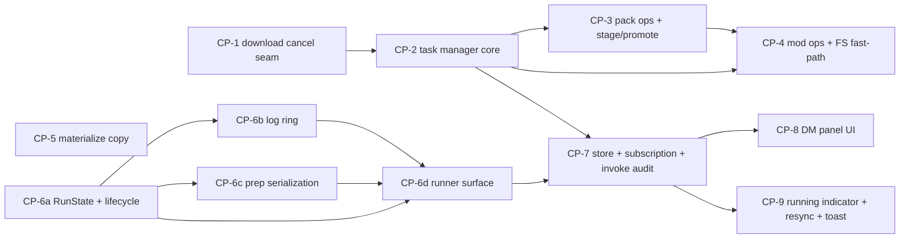

# Download Manager & Runner rework — spec index

This work is split into **9 self-contained checkpoint specs**. Each `cp-N-*.md` is the full contract for one `/subagent-implementation` iteration — a fresh subagent reads only its own file (plus the design for rationale) and never sees sibling checkpoints. Build-critical cross-cutting facts are inlined into each CP that needs them; this index holds shared decisions, the dependency graph, and risks.

- **Design (why):** `docs/design/download-runner-rework.md`
- **Checkpoints (what):** the `cp-*.md` files in this folder.

## Goal

Two decoupled, in-memory backend managers — a serial hierarchical **Download Manager** (task queue) and an N-concurrent **Runner** — surfaced through an app-level Zustand store so every download/install/update/remove and every launch survives page navigation, is observable from any page, and (for download-bearing tasks) is cancellable. Plus full per-instance file isolation (real copies, not hardlinks).

## Locked decisions (apply to all checkpoints)

- **In-memory only** — no restart/crash persistence.
- **Two decoupled lanes** — a download task and a launch run simultaneously; no shared throttle.
- **Download Manager is strictly serial** (one FIFO queue); **Runner is N-concurrent** with **serialized prep**.
- **Command-contract change** — mutating download-bearing commands (pack install/update/import, mod add/update) **return a task id synchronously**; the terminal result is delivered via a `task://update` event keyed by task id, carrying the same fields the command returns inline today. An awaited `invoke` promise cannot survive the navigation that drops it.
- **Cheap FS ops** (enable/disable/remove a mod — no download) run on an **instant fast-path outside the serial queue**.
- **Cancel / atomicity** — instance-bound downloads stage in a same-volume temp dir, then **atomic-promote** (rename) into the instance. Cancel discards staging (instance untouched). No transactional rollback; an interrupted promote is a debug-grade edge (manual reinstall).
- **Done UX** — store-driven **toast with an "Open" action**; no auto-navigation.
- **Isolation** — materialized libs + version jars become real **byte copies** (not hardlinks). **Assets stay shared** (immutable, content-addressed). Mods/configs/settings already per-instance.
- **`execute_download_plan`** stays a direct low-level command — out of the task system.
- **No frontend test harness** — frontend CPs verify via `scripts/build.sh check` (tsc) + stated manual behavior. Backend CPs add Rust tests run via `scripts/build.sh test`.
- **IPC mirror** — `src/lib/ipc.ts` hand-mirrors Rust structs; new task/run payload structs are mirrored into `ipc.ts` in **CP-7**.

## Dependency graph & build order

| CP | Title | Agent | Depends on |
|----|-------|-------|-----------|
| 1 | Download engine cancel seam | atomic-builder | — |
| 2 | TaskManager core | atomic-builder | 1 |
| 3 | Pack ops as tasks + stage/atomic-promote | atomic-builder | 1, 2 |
| 4 | Mod ops as tasks + FS fast-path | atomic-builder | 2, 3 |
| 5 | Storage isolation (hardlink→copy) | atomic-surgeon | — |
| 6a | RunState + status lifecycle + terminal retention | atomic-builder | — |
| 6b | Capped log ring + replay | atomic-builder | 6a |
| 6c | Prep serialization + Preparing phase | atomic-builder | 6a |
| 6d | Runner surface: commands + events + payloads | atomic-builder | 6a, 6b, 6c |
| 7 | Frontend store + subscription + invoke audit | atomic-builder | 2, 6d |
| 8 | Download Manager panel UI | atomic-builder | 7 |
| 9 | Running indicator + launch warning + InstanceDetail resync + toast | atomic-builder | 7 |

**First wave (parallelizable, no deps):** CP-1, CP-5, CP-6a.
**Runner sub-order:** 6a → {6b, 6c} (parallel) → 6d.
**Suggested linear order:** 1 → 2 → 3 → 4 → 5 → 6a → 6b → 6c → 6d → 7 → 8 → 9.

> **Note:** CP-6 was originally one checkpoint and was implemented in full on branch `worktree-agent-af3e8a746e3f00645` (green, 45 launch tests). It was then sculpted into 6a–6d for reviewability — the contract-superseding terminal-retention change is isolated in 6a. See that branch if re-implementing slice-by-slice vs. retrofitting.

## Approaches (task-lane architecture)

| # | Approach | Sketch | Cost | Risk |
|---|----------|--------|------|------|
| A | Actor + command channel only | one worker owns queue; queries via reply channels | med | query round-trips; awkward event snapshot |
| B | `Mutex<HashMap>` + `Semaphore(1)` spawn-per-task | implicit serialization | low | not strict FIFO; fragile |
| C | **Worker actor + `Arc<RwLock<Snapshot>>`** | worker drives serial FIFO; readers read snapshot | med | two structures kept in sync |

**Recommendation: C** — single worker gives strict FIFO + serial for free; shared snapshot makes queries and `task://update` emission cheap (one writer / many readers). Runner extended in place. Evidence: `execute_plan` `download.rs:546` (no cancel seam, `FuturesUnordered` from all items `download.rs:592-609`); `RunningRegistry`/`KillHandle` `launch.rs:536-558`; managed state `lib.rs:1917-1971`; `TauriEventSink` `lib.rs:325-341`; route unmount teardown `InstanceDetail.tsx:88-138`; Zustand unused.

## Risks

| Risk | Likelihood | Mitigation | Owner CP |
|------|-----------|-----------|----------|
| Command-contract change breaks frontend flows (auto-nav import, `Home.tsx` result handling, sync mod-op calls) | high | CP-7 audit-and-remove every `await invoke(…)` of a now-task command; results ride `task://update`; auto-nav → Open-toast (CP-9) | 7, 9 |
| Cancel retrofit into upfront `FuturesUnordered` — in-flight items may finish | med | CP-1: no new permits after cancel; staging+promote makes cancel clean regardless | 1, 3 |
| Interrupted atomic promote leaves instance inconsistent | low | Same-volume rename is atomic; interrupted promote is a non-goal (manual reinstall) | 3 |
| Lock held across `.await` in worker/runner (`launch.rs:552` warns) | med | Snapshot + ring writes are synchronous; extract/clone then release before await | 2, 6 |
| Log ring memory across many concurrent packs | low | Cap ring per instance (~1000 lines) | 6 |
| Disk usage up after hardlink→copy | low | Accepted for isolation; assets stay shared (largest class) | 5 |
| IPC type drift | med | New payload structs mirrored into `ipc.ts` in CP-7 | 7 |

## Open question (non-blocking)

- **DM panel placement** — Sidebar drawer vs. header dropdown. Lean: Sidebar drawer. Implementer's call in CP-8.

## Change log

<!-- Populated on first amendment after approval. -->
