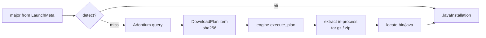

# Java manager (Phase 2, slice C)

## Goal

Given a required Java major (from `LaunchMeta.java_major`), return a usable JRE: detect a
matching system/previously-downloaded JRE first, else download + extract Temurin from the
Adoptium API into `<data>/java/<major>/`. Output a `JavaInstallation` (major + path to the
`java` binary) that slice D spawns.

## Non-goals

- Spawning the JVM / building argv — slice D. This slice only resolves a `java` binary path.
- Per-instance Java overrides UI — `JavaCfg.major` already exists (`instances.rs:34`); wiring
  it into launch is slice D.
- Multi-vendor JRE support (GraalVM, Zulu, etc.) — Adoptium/Temurin only this phase.
- JRE version pinning beyond major (exact build selection) — take Adoptium's "latest" per major.
- `rustls` migration — Phase 7. Stay on `native-tls`.

## Success criteria

- [ ] `ExpectedHash::Sha256` added to the download engine (`download.rs`); a fixture/mock-server
      test verifies a sha256 download succeeds and a mismatch errors. Existing sha1/sha512 tests
      unaffected. `ipc.ts` mirrors the new variant.
- [ ] System JRE detection probes (at least): `JAVA_HOME`, `PATH` (`java`/`java.exe`), common
      per-OS install dirs, and `<data>/java/<major>/`. Detection reads the JRE major from the
      `release` file (`JAVA_VERSION=`) or `java -version` output.
- [ ] Detection is testable without a real JRE: probe locations + target OS are injectable;
      a fixture dir with a `release` file resolves to the right major; a non-matching major
      returns `None`.
- [ ] Adoptium provisioning: builds the `api.adoptium.net/v3/assets/latest/<major>/hotspot`
      query with correct `os`/`architecture`/`image_type`; parses the response into a download
      item carrying the binary link, **SHA-256** checksum, and archive type.
- [ ] Temurin download executes through `download::execute_plan` (the engine), verified by the
      new `Sha256` hash. Dest under `<data>/java/<major>/`.
- [ ] Archive extraction is in-process: `.tar.gz` (Linux/macOS, flate2+tar) and `.zip`
      (Windows, zip) unpacked into `<data>/java/<major>/`. The post-extract `java` binary is
      located (Temurin archives nest under a versioned top-level dir → resolve `**/bin/java[.exe]`).
- [ ] **Extraction rejects path-traversal entries** (zip-slip / `../` tar entries that escape
      the target dir) — a test asserts a malicious entry is refused, not written outside.
- [ ] `ensure_java(major) -> JavaInstallation` = detect-or-(download+extract). A Tauri command
      exposes it; `ipc.ts` mirrors `JavaInstallation`.
- [ ] `cargo test` green (Windows toolchain — see Risks); `npm run build` green. No live HTTP
      and no real archive download in tests.

## Approaches

Design §C (`docs/design/vanilla-launch.md:88-96`) fixed detect-first (C1) with Temurin-download
fallback (C2). Two sub-decisions resolved with the user this planning round:

| # | Decision point | Chosen | Rejected | Why |
|---|----------------|--------|----------|-----|
| A | Archive extraction | In-process crates (flate2+tar for `.tar.gz`, zip for `.zip`) | Shell out to system `tar`/`unzip` | No reliance on external binaries; Windows `tar` is bsdtar (quirky); deterministic + testable |
| B | Temurin checksum | Extend engine `ExpectedHash::Sha256` | Verify in java.rs bypassing engine | Reusable; Temurin verified through the same hash-verified path as everything else; `sha2` already a dep |
| C | Provision source | Adoptium `/v3/assets/latest/<major>/hotspot` | Bundle JREs / scrape per-OS pages | Official API, per-major/os/arch, checksummed; matches design C2 |

## Recommendation

Detect first (cheap, respects user installs + reuses prior downloads via the `<data>/java/<major>/`
probe — the download dir doubles as the cache), download Temurin only on miss. Reuse the existing
engine for the download (`download::execute_plan`, `download.rs:540`) once it speaks SHA-256, so
provisioning gets bounded concurrency, resume, and verification for free. Extraction is the only
genuinely new capability; keep it isolated + path-traversal-safe.

Caption: ensure_java detects a matching JRE or provisions Temurin via the engine + in-process extraction.

## Checkpoints

| # | Checkpoint | Files/areas | Agent | Est. files | Verifies |
|---|------------|-------------|-------|------------|----------|
| 1 | Engine SHA-256: add `ExpectedHash::Sha256` + incremental-hash path; mirror in `ipc.ts` | `src-tauri/src/core/download.rs`, `src/lib/ipc.ts` | atomic-builder | ~2 | Mock-server test: sha256 download verifies; mismatch errors. Existing engine tests still green. `npm run build` |
| 2 | System JRE detection: probe `JAVA_HOME`/`PATH`/per-OS dirs/`<data>/java`; parse major from `release` file or `java -version`; OS + probe-list injectable; `store::java_dir` helper | `src-tauri/src/core/java.rs` (new), `core/mod.rs`, `core/store.rs` | atomic-builder | ~3 | Unit test: fixture dir w/ `release` file → correct major+path; non-match → `None` |
| 3 | Adoptium provisioning plan: os/arch/image_type mapping + query build; parse latest-assets JSON → download item (link, sha256, archive type); execute via `download::execute_plan` | `src-tauri/src/core/java.rs` | atomic-builder | 1 | Fixture Adoptium JSON → assert item link/sha256/dest + correct os/arch in query |
| 4 | Extraction + orchestration + wiring: in-process `.tar.gz`/`.zip` extract (traversal-safe) into `<data>/java/<major>/`, locate `bin/java`; `ensure_java(major)`; Tauri command + `ipc.ts`; Cargo deps (flate2, tar, zip) | `src-tauri/src/core/java.rs`, `src-tauri/src/lib.rs`, `src/lib/ipc.ts`, `src-tauri/Cargo.toml` | atomic-builder | ~4 | Extract a tiny fixture archive → `java` path resolved; traversal entry refused; `ensure_java` detect-hit e2e (no net); `cargo test` + `npm run build` |

## Risks

| Risk | Likelihood | Mitigation |
|------|-----------|------------|
| Adoptium API response shape assumed (no `/gather-evidence` run) | med | CP3 fixture encodes the assumed shape; parse fails fast at impl if wrong. Verify the real shape when wiring CP3 |
| Some majors lack a `jre` image on Adoptium → 404/empty | med | Query `image_type=jre`, fall back to `jdk` on empty result; note in CP3 |
| Zip-slip / tar path traversal writes outside target dir | med | Explicit success criterion + test; canonicalize + prefix-check every entry before write |
| WSL-native `cargo` fails (GTK libs) — build/test must use Windows toolchain | high | Brief carries the mandatory Windows cargo command (per project memory `windows-build-toolchain`) |
| New deps (flate2/tar/zip) inflate Windows build / dep cache | low | One-time; shared `CARGO_TARGET_DIR` already holds the dep cache |
| `java -version` shell-out absent/slow on probe targets | low | Prefer reading the `release` file; shell-out only as fallback, with timeout |
| Temurin archive nests under a versioned dir → `bin/java` not at root | high | Locate via walking for `bin/java[.exe]` after extract, not a fixed path |

## Open questions

- **JRE vs JDK image_type:** prefer `jre` (smaller). If a major has no Temurin `jre` build,
  fall back to `jdk`. Confirm at CP3 against the live API.
- **Detection depth:** how many common install dirs per OS to probe (e.g. macOS
  `/Library/Java/JavaVirtualMachines`, Linux `/usr/lib/jvm`, Windows `Program Files\Eclipse Adoptium`)?
  Start with the obvious ones + `JAVA_HOME`/`PATH`; expand only if it misses real installs.
- **Persisting discovered JREs:** the `<data>/java/<major>/` probe doubles as the download
  cache; no separate registry persisted this slice. Revisit if detection cost bites.

## Change log

<!-- Populated on first amendment after approval. -->

## Implementation log

### shipped — 2026-06-07

Built across 4 checkpoints (+ 1 polish pass) of /subagent-implementation on branch `java-manager`. Commits (chronological):

- `e4eda8a` — CP-1 engine `ExpectedHash::Sha256` + hasher arm + ipc.ts (6 tests)
- `c39e188` — CP-2 system JRE detection: release-file parse, injectable candidates+OS, `store::java_dir` (16 tests)
- `568bfa7` — CP-3 Adoptium provisioning plan: os/arch mapping, query build, parse → sha256 DownloadItem + ArchiveKind, async provision (13 tests + fixture)
- `5aa6f06` — CP-4 traversal-safe tar.gz/zip extraction, locate nested bin/java, `ensure_java` + Tauri command + ipc.ts; folded F-1/F-2/F-3 (8 tests)
- `e053394` — polish: F-4 explicit major-scoped extract dest + test, F-5 zip write via validated path (2 tests)

Final: 109 Rust tests pass (31 download + 33 resolver + 45 java/sha256); `npm run build` clean.

**Out-of-scope work performed during this build:**
- CP-1 is a download-domain change (engine `Sha256`), pulled in as a prerequisite for Temurin verification — in spec scope by design, not drift.
- `tempfile` added as a dev-dependency (CP-2) for hermetic detection fixtures.

**Unforeseens — surprises that emerged during implementation:**
- Adoptium uses OS name `mac`, not Mojang's `osx` — caught + curl-verified at CP-3; explicit test guards it. The spec's "API shape assumed" risk was retired by confirming the real response shape during CP-3.
- `.tar.gz` archive-kind detection must use `ends_with`, not `Path::extension()` (which returns `gz`).
- WSL-native cargo fails on GTK libs → all Rust build/test ran via the Windows toolchain over the WSL UNC path (project memory `windows-build-toolchain`).

**Deferred items still open:**
- None. F-1 through F-5 all closed (F-1/F-2/F-3 in `5aa6f06`, F-4/F-5 in `e053394`).
