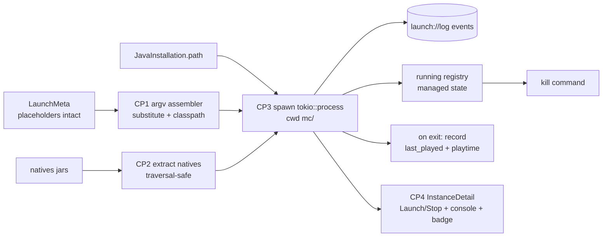

# Vanilla launch (Phase 2, slice D)

## Goal

Spawn a vanilla Minecraft instance to the main menu. Consume `LaunchMeta` (resolver, slice B)
+ `JavaInstallation` (java manager, slice C) + downloaded files (engine, slice A): substitute
the `${...}` placeholders the resolver left intact, extract natives, spawn the JVM with `mc/` as
cwd, stream stdout/stderr as `launch://log` events to an in-app console, allow stopping a running
instance, and record `last_played` + `total_playtime_sec` on exit (natural or killed).

## Non-goals

- Online auth — Phase 3. Launch uses a fixed offline identity (name `Player` + derived uuid).
- Mod loaders / modded launch — Phase 4. Vanilla manifest argv only.
- Crash-log parsing / error-help UI — Phase 7. The console shows raw stdout/stderr lines.
- Per-instance Java-args / memory UI beyond what already exists in the instance model.
- Multi-instance concurrency limits or queueing — multiple instances may run at once; each is
  tracked independently. No global cap this slice.
- Persisting the log console history across app restarts — events are live-streamed only.
- `rustls` migration — Phase 7. Stay on `native-tls`.

## Success criteria

- [ ] **Argv assembly** (pure, fixture-testable): every `${...}` placeholder present in a real
      vanilla `LaunchMeta.jvm_args` + `game_args` is substituted. Classpath joined with the
      OS-correct separator (`:` unix / `;` windows) and includes the client jar. Final argv =
      `[<substituted jvm_args>, main_class, <substituted game_args>]`. Any placeholder left
      unsubstituted is surfaced (logged/error), not silently passed through to the JVM.
- [ ] **Offline identity:** name = `Player`; uuid = UUIDv3 of `OfflinePlayer:Player`;
      access-token + user-type get offline placeholders. `${auth_player_name}`, `${auth_uuid}`,
      `${auth_access_token}`, `${user_type}` resolve from these. A unit test pins the derived uuid.
- [ ] **Path placeholders** resolve to the real on-disk layout: `${classpath}` → the joined
      classpath (above), `${game_directory}` → `<instances>/<slug>/mc/`, `${assets_root}` →
      `<data>/assets`, `${assets_index_name}` → `asset_index_id`, `${natives_directory}` → the
      extracted natives dir, `${version_name}` → `version_id`, `${version_type}` → a new
      `version_type` field on `LaunchMeta` (resolver does not expose it today — CP1 adds it,
      sourced from the manifest `type`). `assets_legacy` instances point assets at the
      legacy/virtual layout instead of `<data>/assets`.
- [ ] **Logging config:** when `LaunchMeta.logging_config` is `Some`, the `${path}` placeholder
      (Mojang's `-Dlog4j.configurationFile=${path}` jvm arg) resolves to the downloaded log
      config path (`<data>/assets/log_configs/<id>`); when `None`, the arg is omitted, not passed
      with a raw `${path}`.
- [ ] **Natives extraction:** each natives entry in `LaunchMeta.natives` (a jar in the
      `libraries/` tree) is unpacked into a per-instance natives dir; `META-INF/` and non-native
      entries are skipped; extraction is path-traversal-safe (no entry escapes the target dir).
      A fixture jar → assert the native files land, a `../` entry is refused.
- [ ] **Spawn:** JVM launched via `tokio::process::Command` with cwd `mc/`, piped stdout+stderr.
      The `launch` command returns promptly (does not block until game exit); the child runs under
      a spawned task.
- [ ] **Log streaming:** stdout + stderr lines emit as `launch://log` events carrying the
      instance id, a stream tag (stdout/stderr), and the line. Frontend mirror type added to
      `ipc.ts`.
- [ ] **Running registry + stop:** running children are tracked in Tauri managed state keyed by
      instance id. A `kill`/`stop` command terminates the child for a given instance. Launching an
      already-running instance is rejected or no-ops (not a second concurrent child for the same
      instance).
- [ ] **Playtime accounting:** on child exit (natural OR killed) the instance's `last_played`
      (ISO-8601) and `total_playtime_sec` (+= elapsed seconds) are updated and persisted via
      `write_manifest`. A test exercises the record-playtime logic without a real JVM (injected
      elapsed / fake exit).
- [ ] **Frontend:** `InstanceDetail.tsx` gains a Launch/Stop control (toggles on running state),
      a live log console subscribed to `launch://log`, a "running" badge, and shows
      `last_played` / `total_playtime_sec`. Display format is minimal: raw ISO string for
      `last_played` is acceptable; playtime rendered as a coarse human duration (e.g. `2h 14m`)
      or raw seconds — either passes, but it must render, not show `undefined`/`null` for a
      never-played instance.
- [ ] **Tests green** (Windows cargo toolchain — see Risks): `cargo test` + `npm run build`.
      Argv assembly, offline-uuid derivation, natives extraction (incl. traversal refusal), and
      playtime accounting are unit-tested with no real JVM. The full launch-to-main-menu is
      verified manually (see Risks — no automated end-to-end).

## Approaches

Design §D (`docs/design/vanilla-launch.md:98-108`) leaned D2 and deferred the call to this slice.
Three forks resolved with the user this planning round:

| # | Decision point | Chosen | Rejected | Why |
|---|----------------|--------|----------|-----|
| A | Process / log transport | **D2** — `tokio::process::Command` + async `BufReader.lines()` readers → `launch://log` | D1 (`std::process` + reader threads) | Async-native; integrates with the existing tokio runtime (engine + every command already async); child owned by a `tokio::spawn` task, no manual thread join |
| B | Offline identity | **`Player` + UUIDv3(`OfflinePlayer:Player`)** | Instance-name-derived identity | Standard Minecraft offline convention; deterministic; avoids sanitizing instance names (spaces/unicode) into a player name. Phase 3 replaces wholesale |
| C | Process-control scope | **Launch + stop/kill** | Launch + observe-only | User wants a Stop control + running badge; the running registry needed to kill is also the cleanest place to hang exit→playtime accounting |

## Recommendation

Build the **pure argv assembler first** (CP1) — it is the load-bearing, fully fixture-testable
core (feed a `LaunchMeta` + resolved paths + offline identity, assert the exact argv), and it
carries no process/OS-spawn risk. **Natives extraction** (CP2) is the one genuinely new I/O
capability; keep it isolated and traversal-safe, mirroring the safety property already proven in
`java.rs`. **Spawn + streaming + registry + playtime + kill** (CP3) is the integration that needs
the tokio runtime and introduces the first `.manage()` managed state in `lib.rs`; its hard-to-mock
parts (a real child) are smoke-tested with a trivial cross-platform process while the playtime
accounting is unit-tested via injected exit/elapsed. **Frontend** (CP4) wires the two new commands
+ the event listener into `InstanceDetail.tsx`.

Argv assembly stays generic over a placeholder map so the implementer owns the exact placeholder
table; the resolver already left every `${...}` intact and OS-filtered the libraries/natives, so
launch never re-evaluates library rules.

Caption: argv assembly + natives extraction feed the spawn; the running registry backs both kill and exit-time playtime accounting; the frontend drives launch/stop and renders the log stream.

## Checkpoints

| # | Checkpoint | Files/areas | Agent | Est. files | Verifies |
|---|------------|-------------|-------|------------|----------|
| 1 | Argv assembler: placeholder substitution over `jvm_args`+`game_args`, OS-separator classpath (incl. client jar), offline identity (`Player` + UUIDv3), path placeholders (`classpath`/`game_directory`/`assets_root`/`assets_index_name`/`natives_directory`/`version_name`/`version_type`/`path`, legacy-assets branch). Add `version_type` field to `LaunchMeta` (resolver, from manifest `type`). New `core/launch.rs` module | `src-tauri/src/core/launch.rs` (new), `core/mod.rs`, `src-tauri/src/core/resolver.rs` (LaunchMeta `version_type`), `src/lib/ipc.ts` (mirror field) | atomic-builder | ~4 | Unit: hand-constructed `LaunchMeta` covering all placeholder types → exact argv; derived offline uuid pinned; unsubstituted placeholder surfaced; classpath separator per OS; `${path}` omitted when `logging_config` is `None` |
| 2 | Natives extraction: unpack each `LaunchMeta.natives` jar into a per-instance natives dir, skip `META-INF`/non-natives, traversal-safe | `src-tauri/src/core/launch.rs` | atomic-builder | 1 | Unit: fixture jar → native files extracted; `../` entry refused; META-INF skipped |
| 3 | Spawn + streaming + registry + playtime + kill: `tokio::process` spawn (cwd `mc/`, piped stdio), reader task → `launch://log` emit, running registry as `.manage()` state, `launch`+`kill` Tauri commands, exit handler records `last_played`+`total_playtime_sec` via `write_manifest`. `LaunchLogPayload` (camelCase mirror) | `src-tauri/src/core/launch.rs`, `src-tauri/src/lib.rs`, `src-tauri/src/core/instances.rs` | atomic-builder | ~3 | Unit: playtime accounting w/ injected elapsed/exit; smoke: spawn trivial cross-platform process → exit observed, playtime persisted, registry cleared. `cargo test` |
| 4 | Frontend: `launchInstance`/`killInstance` wrappers + `launch://log` listener type in `ipc.ts`; `InstanceDetail.tsx` Launch/Stop toggle, live log console, running badge, playtime display | `src/lib/ipc.ts`, `src/routes/InstanceDetail.tsx` | atomic-builder | ~2 | `npm run build` green; manual: Launch streams logs, Stop kills, badge + playtime update |

## Risks

| Risk | Likelihood | Mitigation |
|------|-----------|------------|
| WSL-native `cargo` fails (GTK libs) — build/test must use Windows toolchain | high | Brief carries the mandatory Windows cargo command (per project memory `windows-build-toolchain` — use `apex-build.bat`) |
| No automated launch-to-main-menu test (needs real game files + JRE + display) | high | Unit-test the deterministic parts (argv, uuid, natives, playtime); CP3 smoke uses a trivial process; full launch is a manual verification step, called out explicitly — not claimed as automated |
| Placeholder set incomplete → game crashes or misbehaves on launch | med | Enumerate known vanilla placeholders in CP1; surface any unsubstituted `${...}` loudly (error/log) rather than passing it to the JVM |
| `assets_legacy` (older MC) needs virtual/legacy asset dir, not `<data>/assets` | med | CP1 success criterion branches on `assets_legacy`; resolver already flags it. Defer the actual legacy-asset *materialization* if not already produced by the resolver — note + verify at CP1 |
| First `.manage()` managed state in `lib.rs` (none today) — registry lifetime/locking | med | Standard Tauri pattern: `.manage(Mutex/RwLock<HashMap<id, handle>>)`; CP3 owns introducing it; keep the lock scope tight |
| Child orphaned if the app quits while the game runs | low | Out of scope to fully solve this slice; note it. Detaching is acceptable (game keeps running); don't block app exit on children |
| Natives clash across concurrent launches of different instances | low | Per-instance natives dir keys extraction by instance, not a shared dir |

## Open questions

- **Legacy-asset materialization:** does the slice-B resolver already lay down the
  `assets/virtual/legacy` (or `resources/`) tree for `assets_legacy` versions, or does launch need
  to build it? Confirm against `resolver.rs` at CP1; if launch must build it, that is a CP1 add,
  not a new slice.
- **`user_type` value:** modern MC expects `msa`; pure-offline historically used `legacy`. Pick
  one at CP1 (lean `msa` for modern-version compatibility); Phase 3 sets it for real.
- **Stale-PID after app restart:** the running registry is in-memory only; an instance shown
  "running" cannot survive an app restart. Acceptable this slice (registry resets empty on
  launch) — revisit if it confuses users.

## Change log

<!-- Populated on first amendment after approval. Do not log drafting/refinement turns. -->

## Implementation log

### shipped — 2026-06-07

Built across 5 iterations (+ 1 polish) of /subagent-implementation on branch `vanilla-launch`
(worktree). Commits (chronological):

- `865cc64` — CP1 argv assembler (placeholder substitution, OS-separator classpath, offline
  identity Player + UUIDv3, `${path}`/logging handling) + `version_type` field on `LaunchMeta` +
  `ipc.ts` mirror. 12 tests.
- `64cc8f4` — CP2 traversal-safe natives extraction into a per-instance dir (skip META-INF/dirs,
  zip-slip guard). 3 tests.
- `0b08aeb` — CP3 `launch_instance` orchestration (resolve → download w/ outcome inspection →
  ensure_java → extract natives → build argv → `tokio::process` spawn cwd `mc/`), monitor task
  streaming `launch://log`, slug-keyed `RunningRegistry` managed state (first `.manage()`),
  `kill_instance`, playtime on both exit paths via `write_manifest`. Tauri-free core behind a
  `LaunchSink` trait. 5 tests. (Folds the iter-4 review fixes — see Unforeseens.)
- `6b68280` — CP4 frontend: `launchInstance`/`killInstance` + payload mirrors + event constants
  (`ipc.ts`); `InstanceDetail.tsx` Launch/Stop toggle, running badge, slug-filtered live log
  console, playtime row.
- `bfbdd5e` — polish: guard the launch-event listener effect against the unmount race (F-6) +
  `.catch` on `listen()` (F-7).

Final: 129 Rust tests pass (Windows toolchain); `npm run build` green.

**Out-of-scope work performed during this build:**
- `version_type` added to `LaunchMeta`/`VersionSpec` (resolver, slice-B struct) as a CP1
  prerequisite — the `${version_type}` placeholder had no backing field. In spec scope by design.
- `tokio` features `process`/`io-util`/`time`/`macros`/`rt` + `uuid` `v3` feature added to
  `Cargo.toml` (CP1/CP3).
- First `.manage()` managed state introduced in `lib.rs` (CP3) — none existed before.

**Unforeseens — surprises that emerged during implementation:**
- CP3 first pass had three defects caught by review and fixed in iter 4: (1) `execute_plan`
  outcomes were dropped → a failed download would spawn a doomed JVM silently (now inspected,
  errors before spawn); (2) registry keyed by UUID while commands took a slug → mismatch that
  would have broken CP4 wiring (standardized on slug); (3) `kill_instance` removed the registry
  entry before the monitor exited → TOCTOU relaunch window (monitor is now sole deregistrar).
- The `launch://log` payload field is named `instanceId` (camelCase of Rust `instance_id`) but
  carries the **slug** value; the TS type documents this and the component filters by slug —
  consistent, verified end to end.
- WSL-native cargo is unusable (GTK/WebKit libs) — all Rust build/test ran via the Windows
  toolchain over the WSL UNC path (project memory `windows-build-toolchain`).

**Deferred items still open:**
- `vanilla-launch-f-1` (🟡 risk, project follow-up) — materialize the `assets_legacy` virtual tree
  for pre-1.7 launch; modern versions unaffected.
- `vanilla-launch-f-2` (🔵 nit, project follow-up) — `-Dminecraft.client.jar=` legacy prop gets
  the asset index id instead of the jar path. Coupled to f-1.

**Dropped (with reason):**
- F-4 (natives traversal guard checks full subpath, write uses basename) — the basename write is
  provably contained (`file_name()` strips separators); not a bug, not worth a comment churn.
- F-5 (defensive bare-`META-INF` guard) — correct defensive code; reviewer marked no-action.

**Closed during the build:**
- F-3 (`OFFLINE_PLAYER_NAME` dead-code) — auto-resolved at CP3 when the spawn path began calling
  `build_argv`.

**Manual verification still pending:** launch-to-main-menu with a real MC version + JRE + display
is not automated (deterministic parts unit-tested; CP3 smoke uses a trivial process). See project
memory `windows-launch-test-pending` for the GUI/launch verification path (WSLg vs native Windows).
